# Rising Up: Insights from a Junior to Future Seniors

  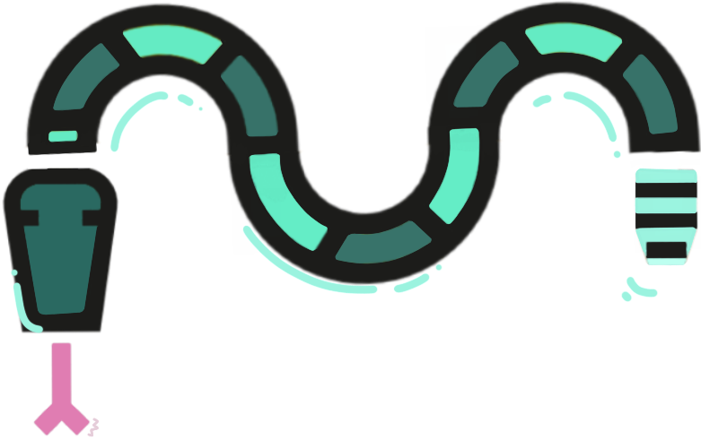

  <strong>A pseudo-book by Judit Lázaro Moyano</strong>

  
  

  <a href="https:/github.com/JuditKaramazov">🐱 /JuditKaramazov</a>

  <a href="https://karamazfolio.xyz/">📍 Portfolio</a>

  <a href="https://karamablog.xyz">☕ Blog</a>

---

Table of Contents
-----------------

* [📖 Preface](#-preface)
* [🌟 Motivation](#-motivation)
* [🧬 Content & Structure](#-content--structure)
  * [1. Books](#books)
  * [2. Websites](#websites)
  * [3. Courses](#courses)
  * [4. Certificates](#certificates)
  * [5. Cheatsheets](#cheatsheets)
  * [6. Your IDE & you](#ides)
  * [7. Learn by coding](#7-learn-by-coding)
  * [8. Game development recommendations](#games)
* [🤝 Contributions](#-contributions)
* [🙌 Immense thanks to them awesome Sponsors](#-immense-thanks-to-them-awesome-sponsors)
  * [🏕️ And let's not forget...](#forget)
* [🏛 License & Copyright](#-license--copyright)

---

# 📖 Preface

After trying to remember the kind of person I was a year ago, it feels almost ironic to find myself here, trying to choose the best words to describe what I would want to communicate. What an illusory, fragile position, this one is. Undoubtedly, many things changed after my first interaction with the concept of “bootcamp”, when I was nothing but a curious woman trying to figure out the meaning behind the elements I was interacting with on my screen. Those first interactions included foundational elements that escalated quickly: HTML, CSS, Angular, Node.js, Mongo DB... honestly speaking, I had no idea about what I was doing - not even when I decided to expand my knowledge and then gave several Python courses a try. Although everything became clearer thanks to that decision, I was still certain about quite a sad reality: I had no clue. The IT world was way too big for me.

Right during one of my last birthdays, I received a call from an IT organization focused on forming future developers, informing me about my candidature and its acceptance. It became visible, tangible, and real as ever before: I made the (right) decision when I chose to focus on a specific area (frontend development and React), but I didn’t believe that I had the capabilities to go through it. I _knew_ I didn't have them. However, time proved that I was wrong: I **did**. Now, approximately a year after that call, I am sitting _here_. A new, delayed train is taking me to the largest and most influential connectivity event in the world, hosted by GSMA in Barcelona: the [MWC](https://www.mwcbarcelona.com/). After so many doubts and inner failures (the ones that do not translate into realities outside ourselves), I just found myself writing this preface prior to expressing the motivation behind the existence of this particular repository. The most remarkable “motivation”, however, is a simple wish. I want to stay in motion. Isn't that ironic, somehow?

Since I do hate empty sentences and words used as if they had no real value or meaning, allow me to highlight the following idea: no, I am not telling you that “you can do this” only because of some cheap, artificial need of adding motivational sentences to my speech. I am telling you that “you can do this” because if I could do it, then you definitely can as well. As a Junior myself, you could take this as some metaphorical love letter to all of you, future seniors, reading these words while I write them down: this journey is not an easy one, but it's worth the effort. We'll get _there,_ independently of the shape of our personal, unique goals. It's just a matter of time.

# 🌟 Motivation

Perhaps I shouldn’t admit I _missed_ Python - but I somehow did. Although my real journey started with JavaScript, the truth is that diving into this specific language made me understand several aspects of myself I wasn’t even aware of before:

1. Surprisingly, I do _love_ programming. If you are wondering why this fact should surprise anyone, bear in mind that I am both **a woman** and **a former literature teacher**, which seemed incompatible with the IT sector and its (apparent) way of approaching and decoding reality. If you are a woman, or just if your background doesn’t fit some people’s expectations, allow me to say something: that’s absurd. Some elements of our persona shouldn’t (can’t, and won’t) limit the scope of our capabilities, so please, do not dare buy that speech. It’s not real. There’s no specific label capable of limiting what we can and can’t do.

2. Surprisingly _again,_ **Python made me comprehend what I couldn’t throughout my first bootcamp**. Even though the “total expansion of my brain” and its evolution into a “developer mindset” arrived during my second formation, Python allowed me to embrace a new perspective that felt forbidden.

3. Python made me **realize the constraints, efforts, struggles, and mentality behind self-taught programmers and professionals in any sector**. After spending so many years strictly following my university’s schedule, I constantly doubted the nature of my own, independent commitment. But it existed. Up to these days, it still does - and this is as certain as it ever was.

    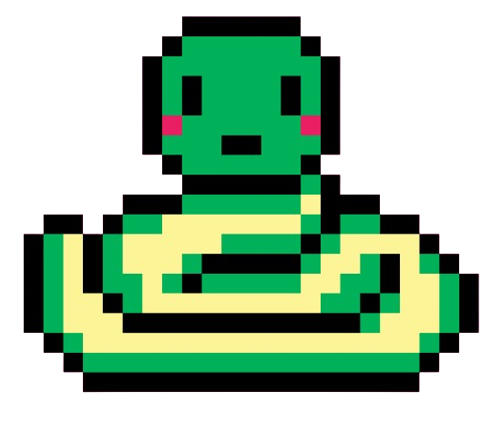
  

I could now conclude this block with an enthusiastic “Python made me better” sentence, but that’s partially true. There are other factors and implications behind the creation of this repository, most of them related to a solid: **“Once a teacher, always a teacher”** way of understanding the world around me. However, allow me to mention a couple of relevant factors:

1. “Once a teacher, always a teacher”, indeed. As someone who struggled to find proper material, documentation, books, or even valuable websites during her university years, I feel responsible for **sharing with anyone interested in learning as many tools and platforms as possible**. These days, learning has become not only a need but a reasonable reality; if you have access to an internet connection, you are good to go. It’s not always so simple to find the materials appropriately accommodated to our personal way of learning, though. Diversity is key. While you will find more complete tutorials, videos, and courses out there, I thought it could be interesting to gather some of them in the same place.

2. My partner in crime, [@AuNedelec](https://github.com/AuNedelec), showed some predisposition (as well as a genuine interest) towards the programming world - more specifically, NLP, also known as [Natural language processing](https://en.wikipedia.org/wiki/Natural_language_processing). Although I bet my companion will find great materials out there, her fascination with this sector genuinely **encouraged me to prepare a bunch of documentation she could find helpful during her journey**. I wish that’s the case.

Last but not least, my projects always provide me with a platform to amplify my words and help them reach other people who, just like me back in the day, might be struggling with both this area of knowledge and their own fears and invisible barriers. For all of you, just as I said before: **you can do this**.

---

# 🧬 Content & Structure

Now, let’s keep this as clear as possible, shall we? The entire content of this repository is closely related to a **hub** in the form of a **website**: 

  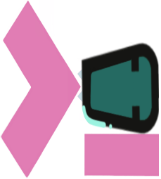
   
  <a href="https://www.pythomazov.tech/">pythoMazov</a>

 

This little application built with Python will **grant you access to every section in a readable, clear, and simple way**; the website exists only due to a matter of accessibility, as I find it way easier to navigate for the vast majority of human beings. If you are curious about the website itself (a **little star would be more than appreciated, stargazers!**), here you'll find the [link to its repository](https://github.com/JuditKaramazov/pythoMazov).

Beyond you’ll find the references leading you to the **different sections of this repository**. We could consider the following list as some sort of **index** establishing the order, placement, content, and weight of each “chapter” of this virtual book of ours.

---

## 1. [Books<a id='books'>](./content/01-Books/README.md)

  This section includes a **free collection of books** regarding different scientific and technological areas: `Programming languages`, `Data Science`, `Machine Learning`, `Software Architecture`...

  

    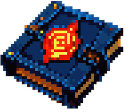
  

  As stated above, I'm trying my best to find **materials available in PDF, HTML, or ePub/eBook formats**; next to each link, you'll find a short note indicating what's that book's specific case.

  > [!NOTE]
  > Although this annotation applies to every online material available in the repository, please do not refrain from letting me know if some of the links are down or broken. Let's make this space a better one altogether!

  ---

## 2. [Websites<a id='websites'>](./content/02-Websites/README.md)

  During my formation, it became overwhelmingly complicated to find appealing, inspiring, or practical websites covering topics that could truly help me improve, rediscover, and reconnect with my learning process. In response to this absence of proper guidance, I've compiled a collection named `Websites`: an **organized array of online sites** allowing you to easily `access the latest industry trends`, `search for cutting-edge tools`, `find high-quality (and free) assets`, and more.

  

    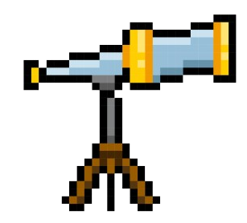
  

  Although I do not doubt better lists are covering this topic out there, `Websites` has been designed to be a one-stop hub for developers seeking appealing, inspiring, and practical resources. From a developer for you.

  ---

## 3. [Courses<a id='courses'>](./content/03-Courses/README.md)

  This is probably one of the most special chapters you'll find here, at least from a personal point of view. Starting with an [Introduction to Python](./content/03-Courses/01-Python/), I'll share a **customized course** explaining the **basics of the language**; once the content is finished and satisfactory enough, we'll move on and go through **intermediate and advanced levels**. You'll even find a couple of things regarding **Git, GitHub**... and more!

  

    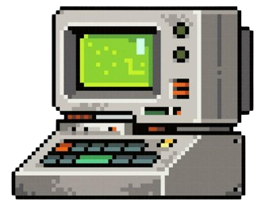
  

  
  Hopefully, we'll **eventually follow a similar approach with languages such as ~~JavaScript~~**, so please be patient. Although there's nothing much for me to share, I'd want to take the proper time to prepare influential, accessible, or just insightful materials allowing you to get started.

  > [!NOTE]
  > 📢 **HUGE ANNOUNCEMENT!** 📢 [JavaScripted](https://javascript-ed.vercel.app), a collection of **modern JavaScript notes, templates and code snippets** is 🎉✨🆕✨🎉 **out** 🎉✨🆕✨🎉! Welcome to our [courses section!](./content/03-Courses/README.md)

  ---

## 4. [Certificates<a id='certificates'>](./content/04-Certificates/README.md)

  Similarly to the books section, `Certificates` aims at offering a **curated list of free, online, and certified courses**, including `different programming languages`, `Back-End`, `Front-End`, `Machine & Deep Learning`, `Data Analysis`... and hopefully, more relevant topics! 

  

    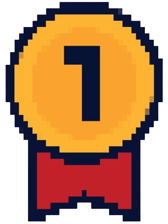
  

  
  As I am a single person working on the content, organization, and courses, it might take me some time to keep everything up to date, though. Remember that your collaboration is key!

  > [!NOTE]
  > There was a moment when I truly considered including badged courses, as they are highly engaging and cover a range of core subjects and professional competencies essential for the modern workplace. For now, I shared certified courses only, but if you guys consider it convenient, I'll surely add some badged ones as well.

  ---

## 5. [Cheatsheets<a id='cheatsheets'>](./content/05-Cheatsheets/README.md)

  Another special chapter, `Cheatsheets`, aims at providing **a concise set of notes used for quick reference**. Starting with a [beginner-friendly set of Python's notes](./content/05-Cheatsheets/01-Python/basics/) and followed by [essential Git commands](./content/05-Cheatsheets/02-Git/), I intend to feed this section enough to cover the needs of your favorite languages.

   

    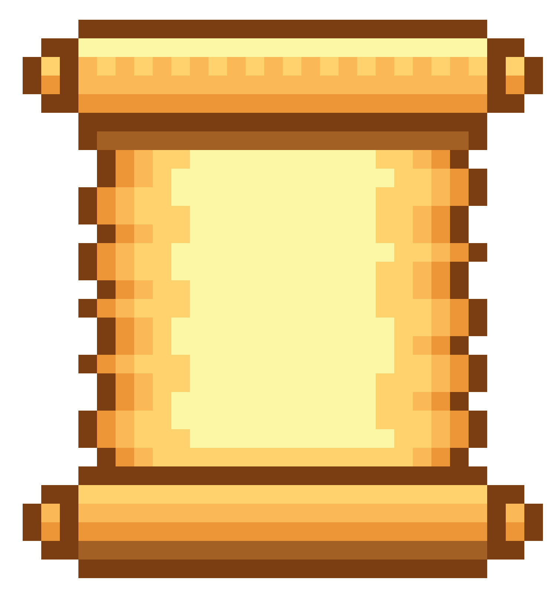
  

  > [!NOTE]
  > If you believe there's a more organic way of distributing the content, please, feel free to request it as a new feature! It would be a pleasure to refactor these notes in a way that matches people's learning paths.

  ---

## 6. [Your IDE & you<a id='ides'>](./content/06-IDEs/README.md)

  There's a lot going on in the developer world. Most of the time, getting started with its many layers feels, if not overwhelming, _imposing._ 

  

    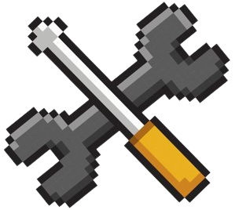
  

  
  Uncertainty is not something affecting the content or the amazingly-high number of available resources only: even the tools required to start building this new knowledge are perceived as confusing, unclear, or not that well defined in our minds. In all honesty, back in the day, **I didn't quite understand what an IDE** (this is, an _integrated development environment_) **was**, and **that's something I wouldn't want you to experience**. Surely, I do not know the magic recipe for making things easier, but hopefully, **you will find some guidelines, descriptions, and recommendations depending on your needs useful enough** now that you're starting your journey.

  You are not alone, guys! And **we've all been there**.

  ---

## 7. Learn by coding

  Practicing is **key** when it comes to programming. While it is undoubtedly essential to build a foundational understanding of the principles and concepts underlying various programming languages, true proficiency only comes through hands-on experience. In other words, **you won't truly learn to code without actively engaging in coding itself**. The more you sharpen your weapon, the more you'll be capable of using it efficiently, and in this case, the weapon you have to care about is your brain, which also happens to be a muscle that needs training. Theoretical knowledge lays the groundwork, but the ability to translate that knowledge into practical solutions is what sets a proficient coder apart.

   

    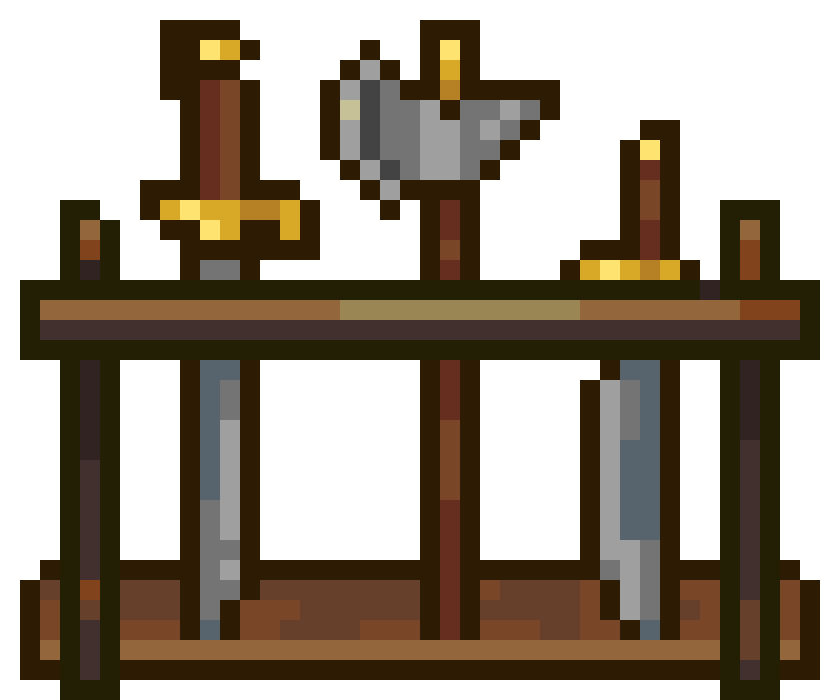
  

  **Work on real projects**. **Collaborate and seek feedback**. Since that's an essential step leading to improvement, [pythoMazov](https://www.pythomazov.tech/challenges) provides you with a **curated list of platforms offering a variety of coding challenges that simulate real-world problems**, such as `Codewars` or `exercism`. Given the wide amount of similar websites:
  
  1. You'll find some of them under a section called `All languages`.

  2. Then, different sections will lead to the languages specified in the title: `Python`, `JavaScript`, `PHP`...

  Some of these platforms use `gamification elements` such as ranking systems, points, and badges. This gamified approach adds an element of fun and competition, motivating users to consistently engage in challenges and improve their skills. **Give them a try!**

---

## 8. [Game development recommendations<a id='games'>](./content/07-Game-development/README.md)

  As for the ones who are more into video games than web development or other programming areas, here is some good news for you: I am **quite** into video games, too. Considering this, I decided to incorporate a chapter dedicated to **game development from the perspective of an indie developer**, which means that you'll find some **guidance, tips, and personal recommendations** about `audio and art tools`, `game engines`, `financing platforms`, `social media`, and more.

   

    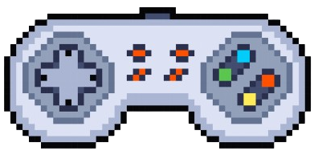
  

  Note that these are my ideas and they do not apply to all possible scenarios. However, given the complex nature of game development, I found it appropriate (if not necessary) to share some thoughts on the industry, the importance of your team and community, the possible scope of your game, and the different tools that could help you release your work.

---

# 🤝 Contributions

Please feel free to contribute to the quality of this content by submitting PRs for improvements related to code snippets, not-so-clear explanations, broken links, etc., just as it was explained in the [Contributing](CONTRIBUTING.md) document. While typo fixes are welcomed, they will likely be caught through normal revisits of the work itself, so don't worry about them at all! Any contributions you make to this effort are greatly appreciated, though, and whatever feedback you can provide me with, I'll take it with pleasure.

---

# 🙌 Immense thanks to them awesome Sponsors

I wouldn't be able to close this chapter without intoning a loud and sincere: `Thank you`. 

To our amazing Sponsor, `@Entreprises LEMRHALI`, `thank you` for your **support**, **presence**, **understanding**, and **vision of things** - and for loving your freshly-new logo! For whatever reason, you genuinely believe that there's something worth your trust here, and thanks to this idea and your own commitment, you gave me the opportunity to breathe when I felt I was suffocating. I can't tell for sure if I'll end up working on the next Dark Souls with our dear Sensei Miyazaki, but if there is something I can assure you about is that I won't let you down. Whatever it is that you saw regarding my capabilities, you were (and are) right about it - and whatever my brain could say on the matter is completely irrelevant.

  

## 
🏕️ And let's not forget...

... The not-so-lost soldiers who had the courage to stick with me throughout the entire process. 

There was a time when I jumped into this "void" represented as the digital space that I'm inhabiting now. Ever since I made that decision, the metaphorical "valley" that I had to walk has been intellectually enriching _and_ challenging beyond measure, so much that I could have easily lost my footing if it wasn't for the steadiness of your trust and care. Whenever I think of it, I can't deny myself the pleasure of recalling that I am indeed indebted to my friends both near and far. You all provided so much of the intellectual (and sometimes _anti-intellectual_, too) force behind this pseudo-book, dissertation, or whatever name we might use to describe it.

Independently of all possible labels and unfruitful nomenclatures, you guys are, were, and always will be a true inspiration and aspiration to me. My `sincerest thanks`, `humble respect`, and `appreciation`; the beautiful France and its mesmerizing Natural stores, the very roots of this Spanish country of ours, the Netherlands and its infinite layers of surprises (am I right, my dear Doctor?), right by my side, day after day. It doesn't matter where you (we) are. `Thank you`, again, for your clarity of vision along the way.

---

# 🏛 License & Copyright

These words live under the [MIT License](LICENSE.txt), and whatever visual or textual content scapes from it, you'll find a proper reference specifying the authors and websites behind that specific content; for instance, the pictures you found above belong to great websites such as [Vecteezy](https://www.vecteezy.com/), as they offer a great amount of free content - thanks for that! 

Attributions are essential these days, and whoever took part directly _or_ indirectly in this project deserves the best recognition. That said, and only if you enjoyed the resources you found here, remember that you can make the Dinosaur extremely happy if you...
 

---

<h1 align="center">
  <a href="https://karamazfolio.xyz/">
</h1>
<h2 align="center">
  
</h2>
