# Inspiring corners of the Interwebz 🖥️

If you have any suggestions or ideas for me to incorporate into this file, you can check our [contribution guidelines](/CONTRIBUTING.md), as they indicate how you could give me a hand with this site's content. Please, **be as specific as possible**, because there are numerous sections and chapters around!

Considering that it's never easy to establish clear divisions delimitating the nature of the resources I'm proposing here, I decided to focus on the **following topics**:

1. Roadmaps.
2. Assets (free, images, sprites, SVGs, icons...).
3. APIs.
4. Inspiration.
5. Notes & Snippets.
6. Stay tuned (news & insights).
7. Tools.
8. UI.

Similarly I'll **include illustrations allowing you to check if that's the style fitting your needs**, as it might help make the decision of using certain assets easier for you!

---

# Table of Contents
-----------------

* [🧭 Roadmaps](#-roadmaps)
  * [Roadmap.sh](#roadmap-sh)
* [🎨 Assets](#-assets)
  * [Open-source illustrations](#open-source-illustrations)
    * [absurd.design](#absurddesign)
    * [Charco design](#charco-design)
    * [DrawKit](#drawkit)
    * [Glaze](#glaze)
    * [Humaaans](#humaaans)
    * [Open Doodles](#open-doodles)
    * [Ouch! by Icons8](#ouch-icons)
    * [Skribbl](#skribbl)
    * [unDraw](#undraw)
* [🔄 APIs](#-apis)
  * [Public APIs](#public-apis)
* [💡 Inspiration](#-inspiration)
  * [Awwwards](#awwwards)
  * [Behance](#behance)
  * [Collect UI](#collect-ui)
  * [Dribble](#dribble)
  * [Free Design Resources](#free-design-resources)
  * [Mobbin](#mobbin)
  * [Muzli](#muzli)
  * [SaaS Landing Page](#saas-landing)
* [📝 Notes & Snippets](#-notes--snippets)
  * [Code snippets](#code-snipets)
    * [Carbon](#carbon)
    * [snappify](#snappify)
    * [Ray.so](#rayso)
  * [Notes](#notes)
    * [Notion](#notion)
    * [Obsidian](#obsidian)
* [📡 Stay tuned](#-stay-tuned)
  * [Bytes](#bytes)
  * [console](#console)
  * [cssweekly](#cssweekly)
  * [Frontend Focus](#frontend-focus)
  * [GitHub Resources](#github-resources)
  * [React Newsletter](#react-newsletter)
* [🔧 Tools](#-tools)
  * [Algorithms](#algorithms)
    * [Algorithm Visualizer](#algorithm-visualizer)
  * [AI World](#ai-world)
    * [AIFINDY](#aifindy)
    * [Codemate.bot](#codemate-bot)
    * [Python Tutor](#python-tutor)
  * [Palette Generators](#palette-generators)
    * [Accessible Color Palettes](#randoma11y)
    * [Colour Palette Generator](#colour-palette-generator)
  * [Shape Generators](#shape-generators)
    * [CSS Gradient](#css-gradient)
    * [Get Waves](#get-waves)
    * [Haikei](#haikei)
    * [Magic Pattern](#magicpattern)
    * [Neumorphism](#neumorphism)
    * [Pattern Monster](#pattern-monster)
    * [Super Designer](#superdesigner)
    * [Visiwig](#visiwig)
  * [README Editors](#readme-editors)
    * [readme.so](#readme-so)
  * [Resources](#resources)
    * [Dev Resources](#dev-resources)
* [🖥️ UI](#-ui)
  * [Material Web](#material-web)
  * [Tailframes](#tailframes)
  * [Toools Design](#tools-design)
  * [TuiCSS](#tuicss)
  * [UIverse](#uiverse)
* [🏛 License](#-license)

---

# 🧭 Roadmaps

## [Roadmap.sh<a id='roadmap-sh'>](https://roadmap.sh)

roadmap.sh is a community-driven website that provides **roadmaps, guides, and educational content** to help developers navigate and progress in their careers. It offers **role-based roadmaps**, **skill-based roadmaps**, **best practices**, **guides**, and **videos**, covering various domains such as:

- frontend development,
- backend development, 
- DevOps, 
- data science, 
- and more!

  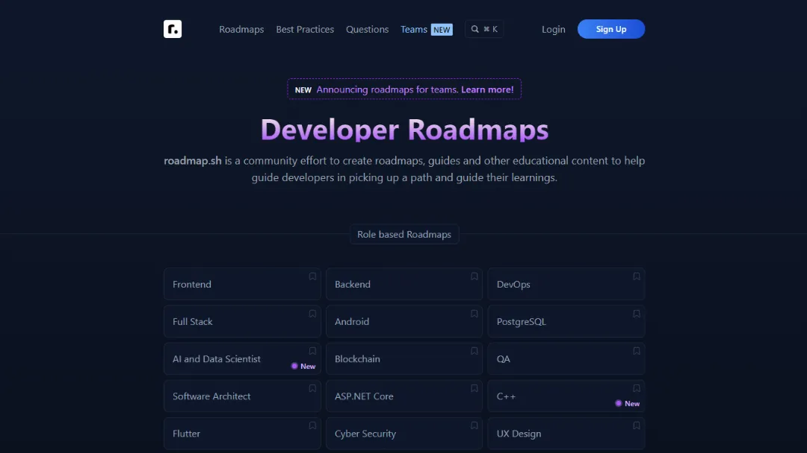

**[⬆ Back to Index](#table-of-contents)**

---

# 🎨 Assets

## Open-source illustrations

### [absurd.design<a id='absurddesign'>](https://absurd.design)

Some of the most creative illustrations I can think of these days. Although most of them are **free**, it is also possible to [join a membership plan](https://absurd.design/#slide-6) in order to support and show some love to her creator, Diana. By doing so, you will **receive new artwork regularly**!

  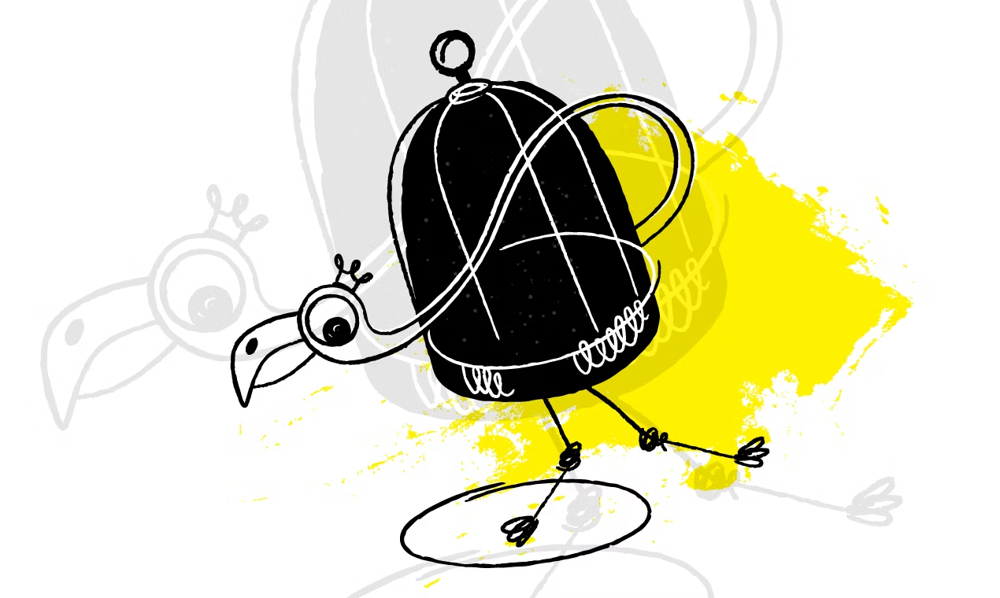

### [Charco design<a id='charco-design'>](https://www.charco.design/) 

Charco is a curated list of **high-quality design resources** including free and premium **icons**, **illustrations**, **UI/UX kits**, **graphics**, **templates**, and more. This studio will provide you with a really great amount of amazing content!

  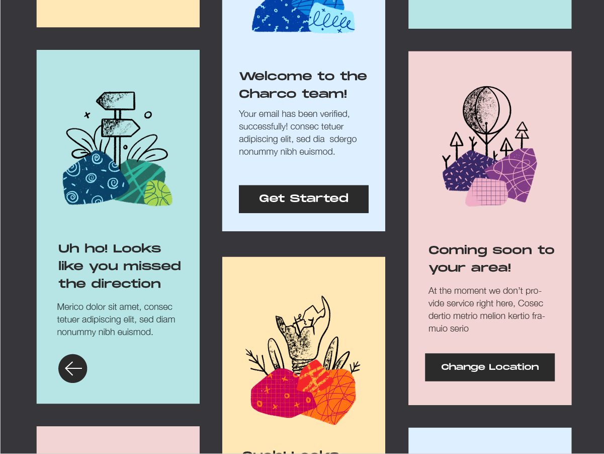

### [DrawKit<a id='drawkit'>](https://www.drawkit.com/) 

Are you looking for **hand-drawn 2D & 3D illustrations, icons and animations**? DrawKit is going to be perfect for your next project, then!

  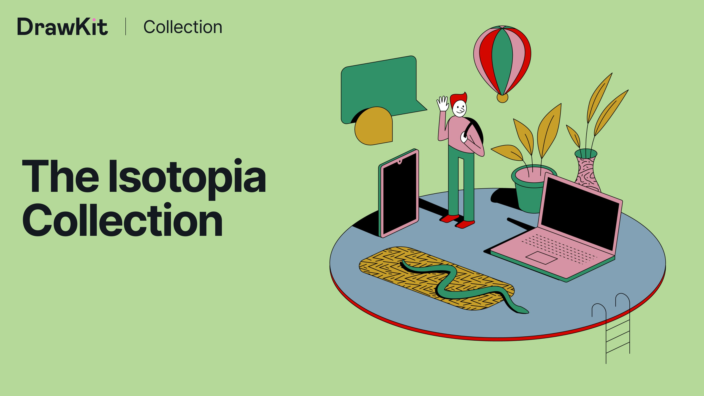

### [Glaze<a id='glaze'>](https://www.glazestock.com/) 

Glaze aims at delivering **free illustrations**, for everything - and they managed to achieve that goal pretty much well! Memorable products, brands, and presentations start with their curated **royalty-free illustration library**.

  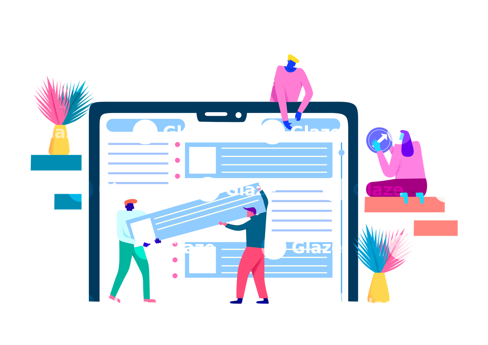

### [Humaaans<a id='humaaans'>](https://www.humaaans.com/) 

What I love the most about Humaaans is that, as a **free library to mix-&-match illustrations of people**, it allows you to **customize their positions, clothing, colors, and hairstyle**. You can **add scenes** and use the power of libraries to make it your own. Simply fantastic!

  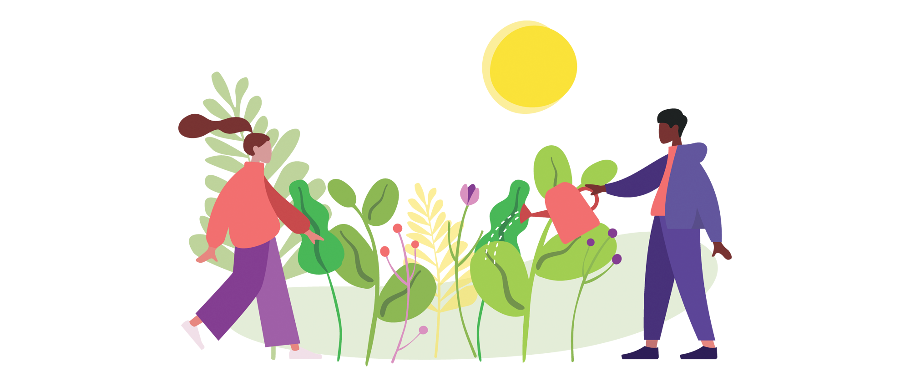

### [Open Doodles<a id='open-doodles'>](https://www.opendoodles.com/) 

A library of **sketchy illustrations of people** free for personal and commercial use, Open Doodles embraces the idea of **Open Design**. You can **copy, edit, remix, share, or redraw these images** for any purpose without restriction under copyright or database law. Customization at its finest!

  

### [Ouch! by Icons8<a id='ouch-icons'>](https://icons8.com/illustrations) 

Ouch! pics is a project of Icons8 dedicated to **free vector illustrations** for user interface. With tons of **trendy and stunning artworks** that match each other perfectly and make your work look professional, Ouch **helps creators who don't draw overcome the lack of quality graphics**. Deeply appreciated!

  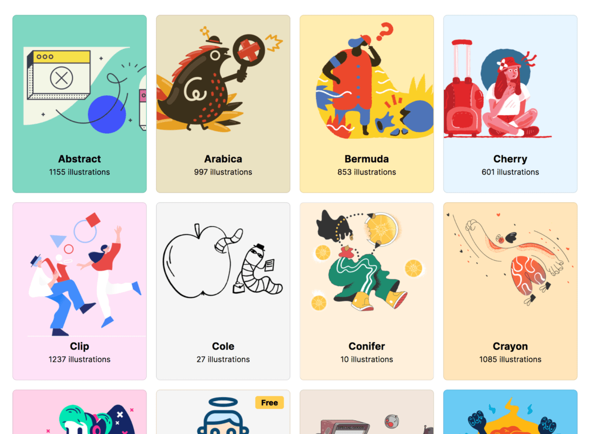

### [Skribbl<a id='skribbl'>](https://weareskribbl.com/) 

**Free-usable, hand-drawn illustrations** brought to you by a growing community of aspiring creatives. It's fantastic to find platforms like this one, where **human-made art are greatly appreciated and promoted**. The style, if you ask me, is simply _neat_. Totally worth a try! 

  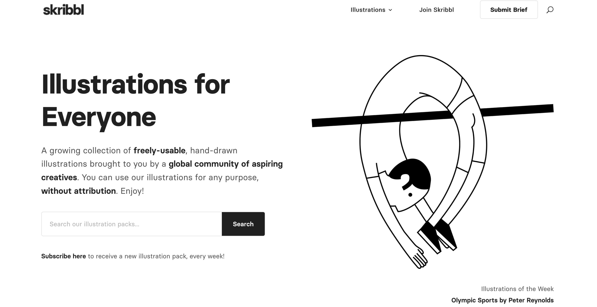

### [unDraw<a id='undraw'>](https://undraw.co/) 

Launched in 2017 with the simple goal to show that designers should contribute to the open-source community, unDraw allows you to **create better designed websites, products and applications** thanks to **customizable images that fit your messaging**. Use them as a normal image, embedded code, or directly in your design!

  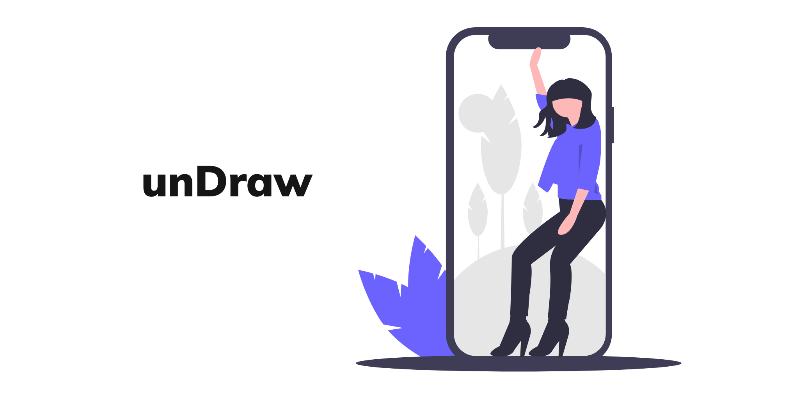

**[⬆ Back to Index](#table-of-contents)**

---

# 🔄 APIs

| Website                                     | Description                                                                             |
|-------------------------------------------------|-----------------------------------------------------------------------------------------|
| [Public APIs<a id='public-apis'>](https://github.com/public-apis/public-apis) | A collective list of free APIs for use in software and web development! 🎉          |

**[⬆ Back to Index](#table-of-contents)**

---

# 💡 Inspiration

## [Awwwards<a id='awwwards'>](https://www.awwwards.com)

Awwwards are the Website Awards that recognize and promote the talent and effort of the best developers, designers and web agencies in the world. An incredible way of celebrating the best of web design!

  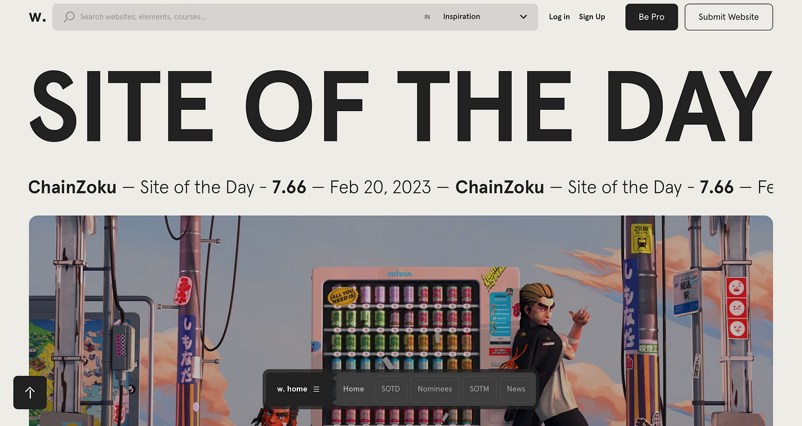

## [Behance<a id='behance'>](https://www.behance.net/)
The world's largest creative network for showcasing and discovering creative work.

  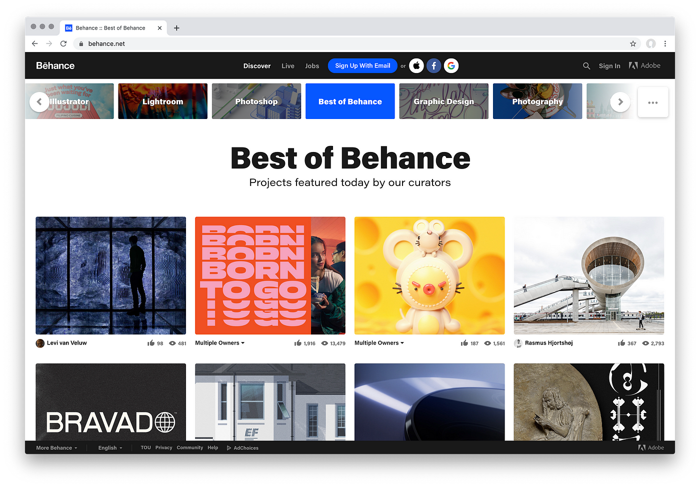

## [Collect UI<a id='collect-ui'>](https://collectui.com)

Daily inspiration collected from daily ui challenge and beyond. Based on Dribbble shots - and hand picked.

  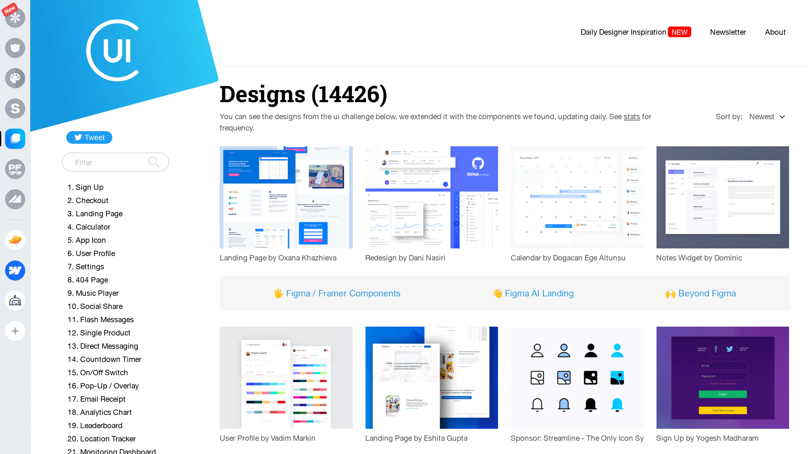

## [Dribble<a id='dribble'>](https://dribbble.com/)
Get inspired by the work of millions of top-rated designers & agencies around the world.

  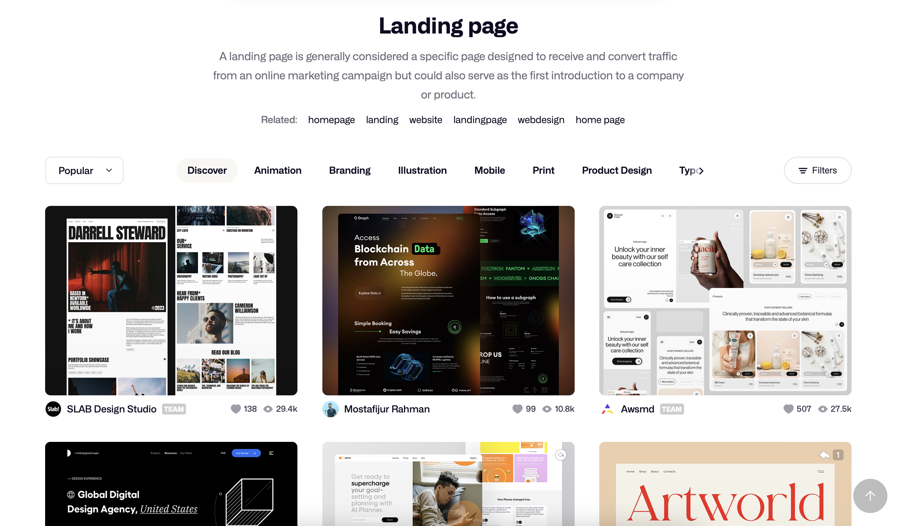

## [Free Design Resources<a id='free-design-resources'>](https://freedesignresources.net)

High quality design resources for free. Crafted with love from amazing artists and professional designers around the world, ranging from **fonts**, **mockups**, **graphics**, **templates** & more.

  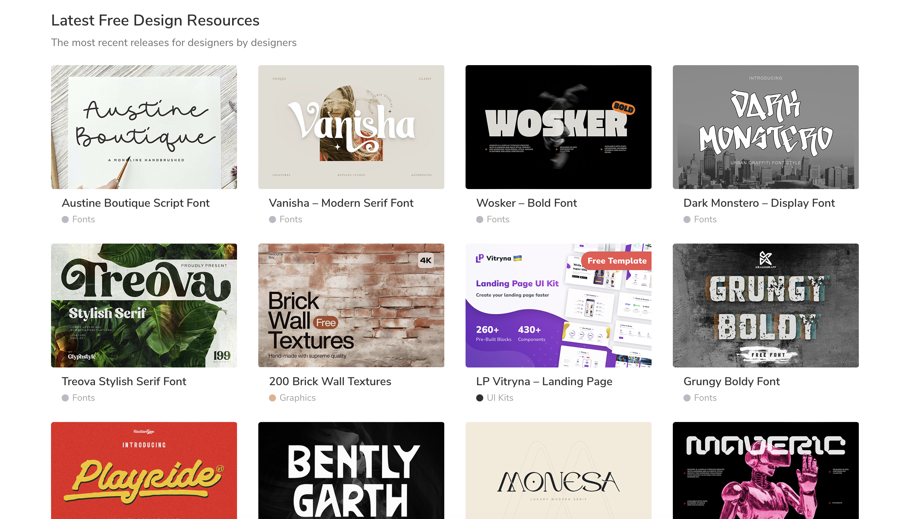

## [Mobbin<a id='mobbin'>](https://mobbin.com/browse/ios/apps)

The world's largest **mobile and web design library**! Save hours of UI & UX research with our library of 300,000+ screens from the world's best designed apps.

  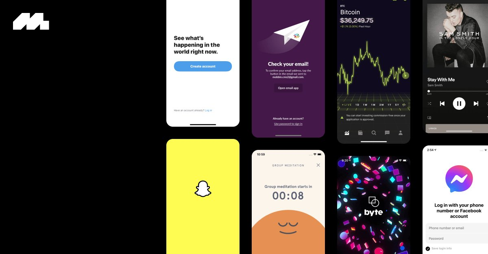

## [Muzli<a id='muzli'>](https://muz.li)

Muzli is a **new-tab browser extension** that instantly **delivers relevant design stories and inspiration** to keep you in the loop.

  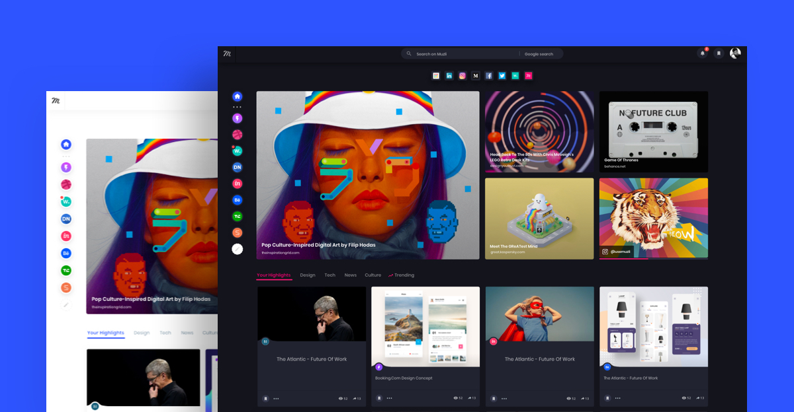

## [SaaS Landing Page<a id='saas-landing'>](https://saaslandingpage.com)

Discover the best **780 landing page examples** created by top-class SaaS companies and get ideas and inspiration for your next design project!

  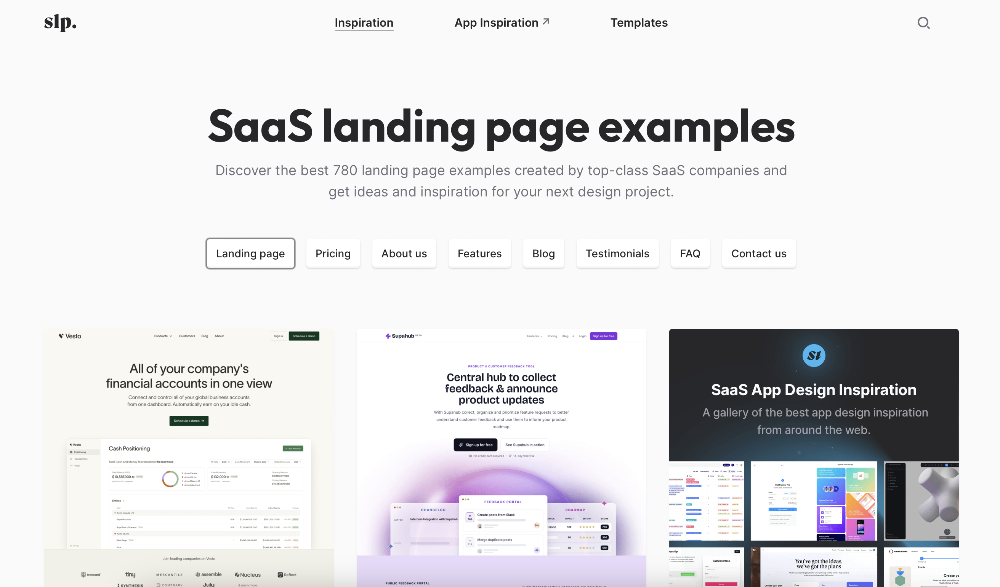

**[⬆ Back to Index](#table-of-contents)**

---

# 📝 Notes & Snippets

## Code Snippets

### [Carbon<a id='carbon'>](https://carbon.now.sh)

Carbon is the easiest way to create and share beautiful images of your source code!

  

### [snappify<a id='snappify'>](https://snappify.com/)

Snappify, which happens to be a great tool, comes with 6 predefined styles to create aesthetic snapshots of your code without the need to spend hours of styling!

  

### [Ray.so<a id='rayso'>](https://ray.so/)

Simple, clean, and intuitive, Ray.so, allows you to choose from a range of syntax colors, hide or show the background, and toggle between a dark and light window when creating images of your code.

  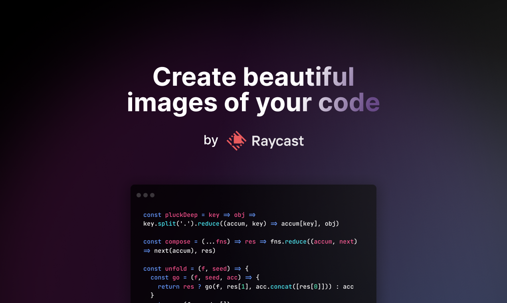

## Notes

### [Notion<a id='notion'>](https://www.notion.so/)

Notion defies traditional categorization. Rather than being several tools bundled together, it's really one big, endlessly customizable digital space that has readymade templates to make it easier to **create documents, plan work, track and manage projects, create knowledge bases** and **structure notes**.

  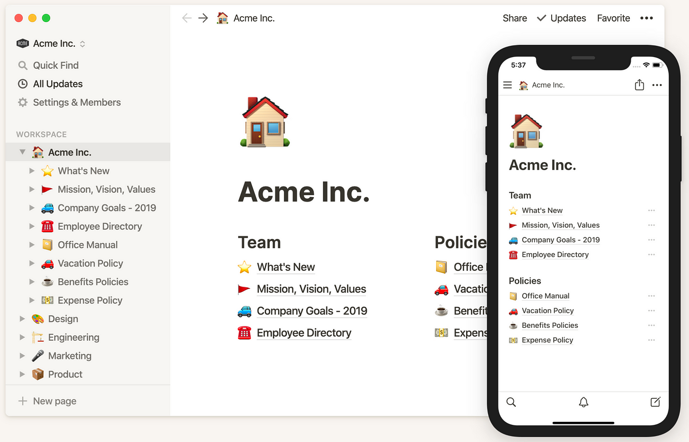

### [Obsidian<a id='obsidian'>](https://obsidian.md/)

Obsidian is a **personal knowledge base and note-taking software application** that operates on **Markdown files**. It allows users to make internal links for notes and then to visualize the connections as a graph.

  

**[⬆ Back to Index](#table-of-contents)**

---

# 📡 Stay tuned

| Website | Description |
| --- | --- |
| [Bytes<a id='bytes'>](https://bytes.dev/) | Your weekly dose of JS! Staying informed on the JavaScript ecosystem has never been so entertaining. Delivered every Monday and Thursday, for free. |
| [console<a id='console'>](https://console.dev/latest) | A weekly digest of the best developer tools. |
| [cssweekly<a id='cssweekly'>](https://css-weekly.com/) | Weekly e-mail roundup of CSS articles, tutorials, experiments, and tools. |
| [Frontend Focus<a id='frontend-focus'>](https://frontendfoc.us/) | A once–weekly roundup of the best front-end news, articles and tutorials. HTML, CSS, WebGL, Canvas, browser tech, and more. |
| [GitHub Resources<a id='github-resources'>](https://resources.github.com/newsletter/) | GitHub's developer newsletter. Get tips, technical guides, and best practices. Twice a month. Right in your inbox. |
| [React Newsletter<a id='react-newsletter'>](https://reactnewsletter.com/) | Stay up to date on the latest React news, tutorials, resources, and more. Delivered every Tuesday, for free. |

**[⬆ Back to Index](#table-of-contents)**

---

# 🔧 Tools

## AI World

| Website                                     | Description                                                                                                             |
|-------------------------------------------------|-------------------------------------------------------------------------------------------------------------------------|
| [AIFINDY<a id='aifindy'>](https://aifindy.com/)         | The largest **database and search engine for artificial intelligence tools**; you can search and filter any AI application here! |
| [Codemate.bot<a id='codemate-bot'>](https://codemate.bot/) | An AI coding assistant that helps developers streamline coding via **AI suggestions, debugging, and code reviews**.          |
| [Python Tutor<a id='python-tutor'>](https://pythontutor.com) | Python Tutor helps you do programming homework assignments in Python, Java, C, C++, and JavaScript. It contains a unique step-by-step visual debugger and AI tutor to help you understand and debug code. |

## Algorithms

### [Algorithm Visualizer<a id='algorithm-visualizer'>](https://algorithm-visualizer.org)

An interactive online platform designed to **bring algorithms to life through visualization**. Whether you're a student, teacher, or professional, this platform provides an engaging way to explore and understand various algorithms!

  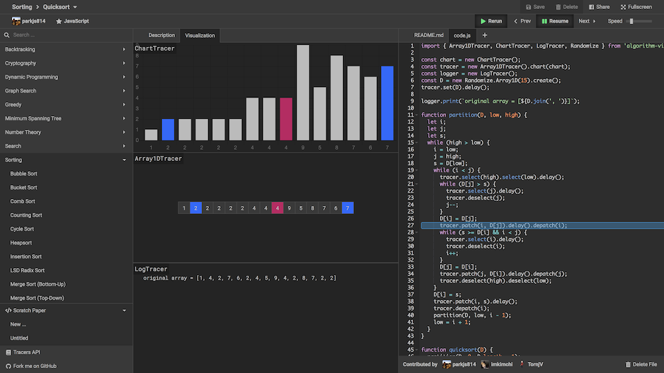

## Palete Generators

### [Accessible Color Palettes<a id='randoma11y'>](https://randoma11y.com)

**Randoma11y** offers a tool allowing you to **get random, accessible color combinations**. Such ideas are more than necessary, so please, do not hesitate to give it a try and show some love and support!

  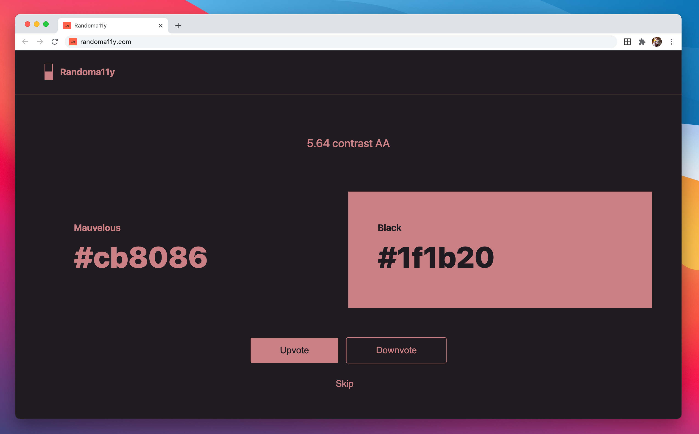

### [Colour Palette Generator<a id='colour-palette-generator'>](https://www.colourpalettegenerator.com)

One of the **best & instant Color schemes generator tool** online that give us a best experience of choosing color combination of creative projects. Different **themes** are included, too!

  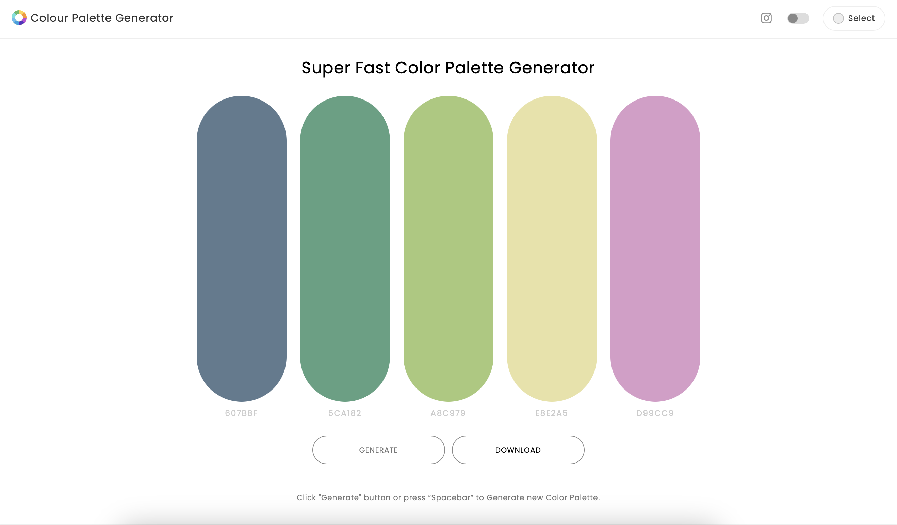

## Shape Generators

| Website                                   | Description                                                                                                                           |
|-----------------------------------------------|---------------------------------------------------------------------------------------------------------------------------------------|
| [CSS Gradient<a id='css-gradient'>](https://cssgradient.io/gradient-backgrounds/)      | As a curated list of the best gradient websites across the internet, Gradient Backgrounds allows you to explore, try and choose from hundreds of beautiful blended color palettes.                            |
| [Get Waves<a id='get-waves'>](https://getwaves.io)      | Make some waves!                           |
| [Haikei<a id='haikei'>](https://haikei.app/)      | Haikei is a web app to generate stunning visual content – ready to use with your design tools and workflow.                           |
| [Magic Pattern<a id='magicpattern'>](https://www.magicpattern.design/) | Create unique graphics for social media posts, landing pages, and branding in a few clicks. Then export them as images, or even code (SVG & CSS). |
| [Neumorphism<a id='neumorphism'>](https://neumorphism.io/)         | Generate Soft-UI CSS code.                                                                                                           |
| [Pattern Monster<a id='pattern-monster'>](https://pattern.monster)    | A simple online pattern generator to create repeatable SVG patterns.             |
| [Super Designer<a id='superdesigner'>](https://superdesigner.co/)    | A collection of free design tools to create unique backgrounds, patterns, shapes, images, and more with just a few clicks.            |
| [Visiwig<a id='visiwig'>](https://www.visiwig.com/patterns/)    | Customize seamless patterns and export for the web or your favorite vector software.            |

## README Editors

### [readme.so<a id='readme-so'>](https://readme.so/) 
An online editor to help developers make READMEs for their projects. An amazingly great tool!

  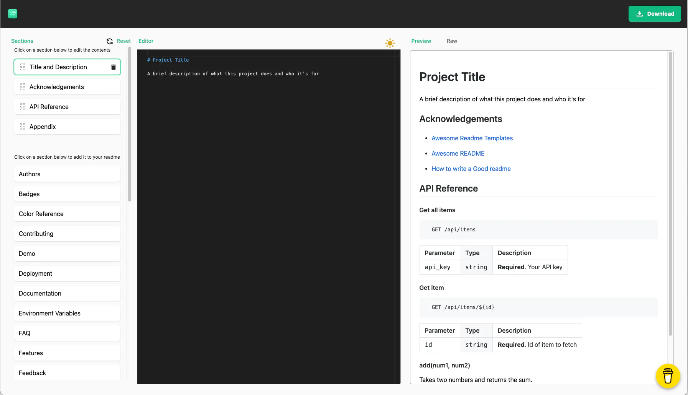

## Resources

### [Dev Resources<a id='dev-resources'>](https://devresourc.es)

A **collection of resources** for developers, **categorized and crowdsourced**. Learn programming, UI inspiration, job boards, images, icons and much more! Similarly to this repository, you can [contribute by adding resources here](https://github.com/marcelscruz/dev-resources).

  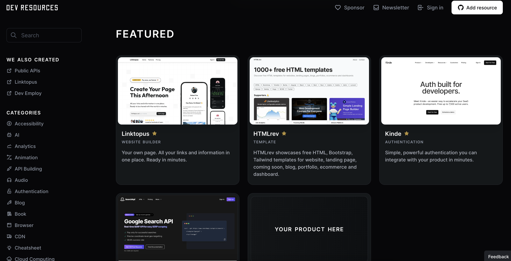

**[⬆ Back to Index](#table-of-contents)**

---

# 🖥️ UI

| Website          | Description                                                                                                                                                            |
|----------------------|------------------------------------------------------------------------------------------------------------------------------------------------------------------------|
| [Material Web<a name='material-web'>](https://m3.material.io/develop/web) | Material web components is a UI toolkit to build customizable and accessible web applications; Material 3 is the latest version of Google's open-source design system. Check their [official web component set here!](https://material-web.dev) |
| [Tailframes<a id='tailframes'>](https://www.tailframes.com)          | Tailframes is your go-to **UI kit** crafted to streamline and elevate the web application development experience with Tailwind CSS. Explore a visually **stunning collection of web components**: - Built with Tailwind. - Ready for HTML and React. - With complete blocks available! |
| [Toools Design<a id='tools-design'>](https://www.toools.design/)     | Discover highly useful Design Resources & Tools thanks to a growing archive of 1,500+ design resources, frequently updated for the community!                                  |
| [TuiCSS<a id='tuicss'>](https://github.com/vinibiavatti1/TuiCss)     | Are you a nostalgic? TuiCss is a library focused on creating web applications using an interface based on ASCII tables, reminiscent of old MS-DOS applications.                |
| [UIverse<a id='uiverse'>](https://uiverse.io)                       | Open-Source UI elements for any project. Create, share, and use beautiful custom elements made with CSS or Tailwind!                                                    |

**[⬆ Back to Index](#table-of-contents)**

**[🔙 Back to Main Index](../../README.md)**

---

# 🏛 License

My words, will, and energy left after gathering all this information belong to me only, but I do not own any specific website listed here. Please refer to the sites themselves to fully understand the peculiarities of their copyright, and don't forget to always mention the original sources and authors you're including in your work.

As for the rest, thank you kindly for your patience and time! Oh, and remember that if you found this helpful in any way, you can make a Dinosaur extremely happy, so please...
 

---

<h1 align="center">
  <a href="https://karamazfolio.xyz/">
</h1>
<h2 align="center">
  
</h2> 
