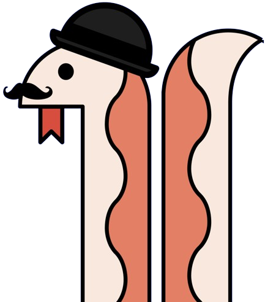

# Python: From Zero to Snake Eater 📦🐍

First of all, allow me to gently welcome you to this `Python Course` aiming at exploring the language's many layers from different prisms - yet always in an affordable way. No matter if you are an **experienced programmer who already got involved with a different language** or **a complete beginner with no IT background**, the main purpose of this repository is to offer you the tools to either **start understanding the main blocks you'll use to build future knowledge**, either **keep up the good work with insightful, hopefully-new tools**.

  

The content will be divided as follows:
  - **Introduction**:
    An approachable way of getting into Python's very basics, which are indeed an essential, compulsory part of the learning process. Although you'll soon start exploring the tools you truly need without the need to interiorize _everything_, just as my dear mentor, Luis, once told me: "there are things we need to know with the same certainty we know our own names. If someone asks you for your name, you won't hesitate in your answer; these basics _must_ be exactly the same type of answer". 
  - **Intermediate**:
    The in-between step, perfect for those who understood the basic notions of Python.
  - **Advanced**: 
    The _ultimate hell_ - maybe _that_ was exaggerated. In this case, we'll dive both into more complex concepts and the usage of Python for the backend.

> [!TIP]
> If you are new to the programming world, you might find the [IDEs dedicated chapter](../../06-IDEs/README.md) quite helpful in order to get started. On the other hand, if you'd want to look for something more specific, remember that there's a [cheat sheets section focused on Python](../../05-Cheatsheets/01-Python/README.md) as well!

---

Table of Contents
-----------------
### Introduction

[Module 0: Setup](./Introduction/00_setup.py)
  1. Pythonese greetings
  2. Installing Python
  3. Setting up a Development Environment

[Module 1: Introduction to Python:](./Introduction/01_hello_pythoverse.py)
  1. Your first Python program.
     - Writing your first Python program.
     - Using `print()` function to display output.
  
  3. Understanding comments in Python.
     - Single line comments with `#`
     - Multi-line comments with `'''` or `"""`
  
  5. Introduction to data types.
     - Strings (`str`).
     - Integers (`int`).
     - Floats (`float`).
     - Complex Numbers (`complex`).
     - Booleans (`bool`).
  
  7. Understanding the `type()` function.
     - Examples.

_Module 2: Variables and assignements:_ --> 🚧 **Under construction!** 🚧

---

**[🔙 Back to Main Index](/README.md)**

---

# 🏛 License

The following words, sections, and recommendations live under the structure of the [MIT License](LICENSE.txt), as they belong uniquely to me. I do not own any specific links or images, though - and I surely didn't create Python myself! For whatever external reference, links, or assets, I'll mention the original authors, as it is crucial to preserve the integrity of their incredible work. In this case, the awesome (and fancy) snake you saw above belongs to the image of **the** conference to attend: [PyCon Italia](https://2024.pycon.it/en). If you have the opportunity to go to Florence, don't miss the date!

Thank you kindly for passing by, dear Snake Eater! Now, I'll take some time to recover from the brain damage suffered after writing so much, but if you'd want to assist me, remember that you can make the Pythonese Magister (which happens to be a Dinosaur) extremely happy if you...
 

---

<h1 align="center">
  <a href="https://karamazfolio.xyz/">
</h1>
<h2 align="center">
  
</h2> 
