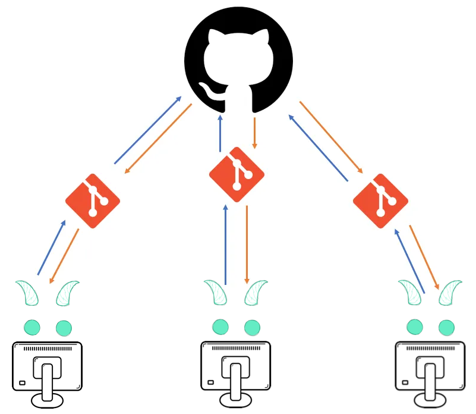

# Module 0: Git vs GitHub

---

Table of Contents
-----------------
* [💡 0. Initial clarifications](#-0-initial-clarifications)
  * [🔍 Are Git and GitHub the same thing?](#-are-git-and-github-the-same-thing)
  * [🔄 How are Git and GitHub related?](#-how-are-git-and-github-related)
  * [📊 Main differences between Git and GitHub](#-main-differences-between-git-and-github)

---

## 💡 0. Initial clarifications

Welcome to the `Zone 0` (_it won't be hazardous at all, I promise_) of our `Git and GitHub course`! In this brief module, we'll explore the fundamental **differences and similarities** between two essential tools in the world of software development: **Git and GitHub**. 

Although it's important to delimit some clear divisions between these tools prior to future analysis and in-depth explanations, bear in mind that whatever does not feel so clear right now, will definitely make sense later on.

Understanding that **Git and GitHub are not the same thing** is what truly matters at this point. In the near future, and no matter the many options available out there (spoiler: no, GitHub is **not** the only option, but it's indeed a **very popular one**), **you might need to integrate them both in order to work on certain projects requiring collaboration and advanced features**. In my case, due to certain limitations affecting the first programming course I ever attended, my inaugural contact with these tools implied GitHub alone - but that doesn't have to be the case for everyone! **Different courses and projects require different tools and approaches**, but what's clear is that, eventually, you'll have to deal with a scenario requiring you to go deeper into the matter.

Whatever the case, keep this in mind: when the time comes for you to **collaborate with others on a project, the process will normally follow these steps**:

1. You will **work on your code**. In order to **share it**, you will **upload** (vocabulary time: **push**) **it to GitHub**. 
2. Then, others will be capable of **downloading** (vocabulary: **clone**) your code and start working on it.
3. After they **have made some changes and want to share it** with you, they will **push those changes up to GitHub**. 
4. Finally, you'll be able to **pull the changes down to your local Git** and **see what they have done**. 

> [!TIP]
> Now, it's dictionary time! Here are some key concepts:
> 1. **Push** -> sending your local changes to a remote repository, making them accessible to others.
> 2. **Clone** -> creating a local copy of a remote repository on your computer.
> 3. **Pull** -> fetching and integrating changes from a remote repository into your local copy.

Later on, we will see how to **connect Git and GitHub**, but how about we start exploring the very essentials? Git, GitHub... They sound similar, but they are not the same, are they?

---

### 🔍 Are Git and GitHub the same thing?

No, **Git and GitHub are not the same thing**. They are **related concepts but serve different purposes** in the context of version control and collaborative software development. For clarification purposes, let's establish a preliminary description for them both:

- **Git**: Git is a distributed version control system (VCS) used for tracking changes in source code during software development. It allows multiple developers to work on a project simultaneously without conflicts, facilitating efficient collaboration and version management.

  

> [!IMPORTANT]
> It sounds a bit like a foreign language, doesn't it? Let's **break it down**: Git is a tool that **helps you keep track of changes you make to your files**. Imagine it as some sort of notebook where you **write down every change you make, along with a note explaining what you did**. This way, you can always go back and see what you've done, undo any mistakes, and seamlessly collaborate with others, as you guys will always be on the same page! 

- **GitHub**: GitHub, on the other hand, is a web-based platform that **provides hosting for Git repositories** and **allows developers to store, share, and collaborate on code repositories**. It adds a layer of functionality on top of Git, offering features such as issue tracking, pull requests, project management, and collaboration tools.

  

> [!IMPORTANT]
> As its name is descriptive enough, let's take it as our starting point: GitHub is somehow like an **online hub where you can store your notebooks** (exactly: the same ones you created with Git) and **share them with others**. It's like a public library where people can **contribute to projects, collaborate on them, and explore what others have created**. It's not just a storage space; GitHub is also a platform for collaboration, learning, and building things together.

---

### 🔄 How are Git and GitHub related?

While Git and GitHub are distinct entities, they are indeed closely related. Long story short, **Git is a version control system** and **GitHub is a web service that helps you collaborate with others** using Git. 

- **Git**: Git is the underlying version control system that manages the history of changes in our project's code. It operates locally on our machine and does not require an internet connection to function. What's great about Git is that it enables developers to track changes, create branches, merge code, and revert to previous versions efficiently.

> [!IMPORTANT]
> You don’t need GitHub to be able to use Git, but if you want to back up your projects in the cloud or share them with others, you can surely use GitHub!

- **GitHub**: GitHub serves as a hosting platform for Git repositories, providing a centralized location for storing and sharing code. Developers can push their local Git repositories to GitHub, making them accessible to collaborators worldwide.

Since we'd want to keep things as simple as possible, let's imagine that this drawing represents how Git and GitHub are interconnected:

  

Remember the schema defining the usual steps we'd follow to work collaboratively with others? Now, we'll add Git to the equation:

1. As stated previously, we can **push**, **clone**, and **pull** our code.
2. In order for Git to send our projects to GitHub, however, we will need to **give our project a remote address**. 
3. How can we do that? We can simply **go to GitHub and create a "home" for our project**, something that's called a **"repository"** (somehow like a folder where we can save our files). 
4. Then, we'll **give the address of that repository to Git**. 
5. After doing so, we will be able to **push our files to their new remote home** (repository) **on GitHub**.

Just like we mentioned earlier, once our **project has a "home"/repository**, we'll be able to **upload/push our changes**, others will be allowed to **download/clone them**, and so on! Do not worry about a thing, though; we'll definitely explore these concepts further, but I bet that, by now, we can all firmly say that **Git and GitHub are indeed different tools**.

---

### 📊 Main differences between Git and GitHub

Now that the distance separating one concept from the other got clearer, let's delve into the **main divisions we could establish between these two tools**, no matter if there are indeed more differences than the ones collected below:

| Git ☁️🔄                                              | GitHub 🐱🐙                                                |
|--------------------------------------------------|-------------------------------------------------------|
| Git is a command-line tool.                     | GitHub offers a graphical user interface (GUI) for interacting with repositories. |
| Git is a distributed version control system.    | GitHub is a web-based hosting service for Git repositories. |
| Git is installed locally on the system.         | GitHub is hosted on the web and accessed through a browser. |
| Git is focused on version control and code sharing. | GitHub is focused on providing centralized source code hosting and collaboration features. |
| Git is a software.    | GitHub is a service.  |
| Git has no built-in user management feature.    | GitHub includes a built-in user management feature.  |
| Git requires minimal external tool configuration. | GitHub has an active marketplace for integrating third-party tools. |
| Git provides a Desktop interface named Git GUI. | GitHub provides a Desktop interface named GitHub Desktop. |
| Git competes with CVS, Azure DevOps Server, Subversion, Mercurial, etc. | GitHub competes with GitLab, Bit Bucket, AWS CodeCommit, and others. |

---

<h1 align="center">
  <a href="https://karamazfolio.xyz/">
</h1>
<h2 align="center">
  
</h2> 
