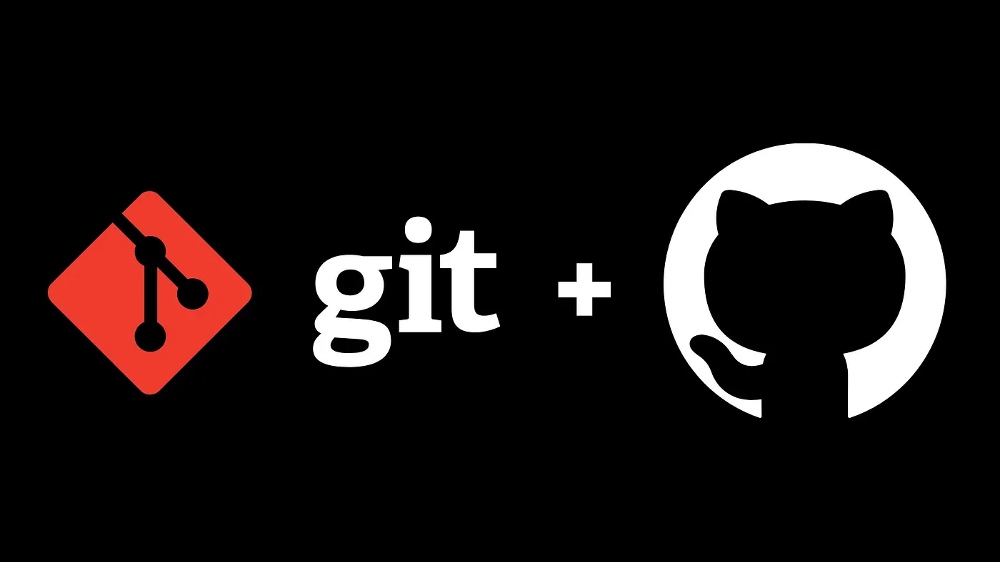

# Git gut at Git: A hub ⛺🛖⛺

Now that I can gently welcome you to this `Git and GitHub little course`, allow me to emphasize that the naming convention surrounding programming languages and resources is, generally speaking, _anything_ but intuitive. Have you been scolded after confusing Java with JavaScript yet, for instance? Are they connected in some way, or is the connection merely superficial? If you are wondering what's the case situation with Git and GitHub, you came to the right place; just like you, we all found ourselves quite confused as soon as these concepts made an appearance.

Although it's more than frequent to find articles featuring detailed and complex diagrams with tons of arrows pointing everywhere in order to explain this technology, we'll try our best to **keep things as simple as possible here**. Sadly, **the technical documentation on Git usually feels unapproachable for a beginner**, with a special focus on developers who already have a strong handle on programming theory. That's not what we'd want to achieve. Surely, we'll offer **key concepts for both beginners and experienced developers**, but there's no way we'll leave any of you behind.

That said, and _only_ when you feel comfortable enough with all the concepts we'll explore, you should definitely [check out Git's technical documentation](https://git-scm.com/book/en/v2), as it will provide you with excellent insight on the matter. However, I'd suggest **leaving the original documentation aside from now**, as it might feel overwhelming and, eventually, frustrating.

There are tons of resources out there, and the fact that **a certain type of documentation doesn't work for us shouldn't become the kind of heavy and discouraging load we can't overcome**! We all understand things in different ways, and as far as you keep going, all of them are fine.

  

---

Table of Contents
-----------------

1. **[Module 0: Git vs GitHub](./Introduction/Module-0-git-vs-github.md)**
   - 0: Initial clarifications
     - Are Git and GitHub the same thing?
     - How are Git and GitHub related?
     - Main differences between Git and GitHub

2. **[Module 1: Introduction to Version Control](./Introduction/Module-1-introduction-version-control.md)**
   - 1: Understanding Version Control
     - What is version control?
     - Why do we need version control?
     - Benefits of version control systems (VCS)

3. **Module 2: Getting Started with Git** --> 🚧 **Under construction!** 🚧
   - 2: Introduction to Git
     - What is Git?
     - Key concepts: repositories, commits, branches
   - 3: Installing Git
     - Installation guide for Windows, macOS, and Linux
   - 4: Configuring Git
     - Setting up user name and email
     - Basic Git configurations

4. **Module 3: Working with Git Basics**
   - 5: Creating a Git Repository
     - Initializing a new repository
     - Cloning an existing repository
   - 6: Basic Git Workflow
     - Adding and committing changes
     - Viewing commit history
     - Checking out previous commits
   - 7: Branching and Merging
     - Creating branches
     - Merging branches
     - Resolving merge conflicts

5. **Module 4: Collaborating with Git**
   - 8: Working with Remote Repositories
     - Introduction to remote repositories
     - Adding remote repositories
     - Pushing and pulling changes
   - 9: Collaborating on GitHub
     - Creating a GitHub account
     - Forking repositories
     - Making pull requests
     - Reviewing pull requests

6. **Module 5: Git Best Practices and Advanced Topics**
   - 10: Git Best Practices
     - Writing meaningful commit messages
     - Ignoring files with .gitignore
     - Using Git aliases
   - 11: Advanced Git Topics
     - Rewriting history with interactive rebase
     - Working with submodules
     - Using Git hooks

7. **Module 6: Conclusion and Next Steps**
   - 12: Recap and Next Steps
     - Summary of key concepts learned
     - Further resources for learning Git
     - Next steps in your Git journey

---

**[🔙 Back to Main Index](/README.md)**

---

# 🏛 License

These words live under the probably-gut structure of the [MIT License](LICENSE.txt), which we could also call a "hub" for people willing to share content. However, I do not own any specific links or images that you may find included in my work except for the ones that I tag as original content. For whatever might escape from that label, I'll always mention the source, as it is crucial to preserve the integrity of the work created by some of our fellow humans; for instance, the Git plus GitHub image belongs to a Medium post called ["A Runbook for Cloning a Git Repository from GitHub to a RedHat Enterprise Linux 7 Cloud Server"](https://medium.com/@sidras-cloudy-world/cloning-a-git-repository-from-github-to-a-cloud-redhat-enterprise-linux-7-server-267ae8bde9af) by [Sidra J](https://medium.com/@sidras-cloudy-world). Do not hesitate to have a look at their content, as it's genuinely a great resource!

Thank you kindly for your time, Skeleton! Oh, and remember that you can make the Dinosaur extremely happy if you...
 

---

<h1 align="center">
  <a href="https://karamazfolio.xyz/">
</h1>
<h2 align="center">
  
</h2> 
