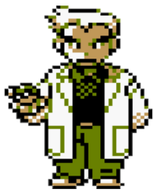

# karamaCourses made with <❤️>

Honestly speaking, I consider myself someone aware of what's happening in the programming community, but sometimes, it might feel like I live slightly disconnected from the digital world surrounding me. The truth is that such a universe doesn't sway my pursuit of good answers to the correct questions, though.

The first time I realized that I wanted to prepare some online material that I could share with other learners, I told myself that I wouldn't be capable of delivering what some might describe as the "latest best practices". That's never been the point. It's not about removing myself from temporal influence by uncovering several underlying truths regarding certain languages; if anything, this is a place meant both for sharing and learning while the process of "teaching" goes on.

  

I do not know why programming languages behave the way they do in certain situations. There are many things I simply do not know, not even at the most basic level. This one is an excuse to get ourselves, you and I, started, though, as I find it crucial to go through certain processes before venturing forward into the constructs of any language.

Now, and just for clarification purposes, allow me to remind you that here you'll find the proper connection leading to the specific languages we'll cover from now on. If by any chance you can't find a link redirecting you to a specific language or section, it means that **the content is still not available**. Also, since I am aware of the density and complexity of the content _we are sharing_ here, I added a short description of the elements you'll find per chapter in each of the following introductions, which will hopefully make the navigation of this "book" slightly easier.

> [!NOTE]
> As you probably noticed, the table of context displays few elements by now, but it's always better to get things done slowly but in the right way than simply trying to work on way too many things at once. If there are any languages you'd want to find here, please, **share your thoughts in the form of a requested feature** - and **give me some time** just so I can finish the proposed material at human pace!

---

Table of Contents
-----------------

1. [Python](./01-Python/README.md)
  - 1.1. [Introduction to Python](./01-Python/Introduction/00_setup.py)
  - 1.2. Intermediate
  - 1.3. Advanced

2. [Git & GitHub](./02-Git-GitHub/README.md)
  - 2.1. [Git vs GitHub](./02-Git-GitHub/Introduction/Module-0-git-vs-github.md)
  - 2.2. [Introduction to Version Control](./02-Git-GitHub/Introduction/Module-1-introduction-version-control.md)
  - 2.3. Getting Started with Git
  - 2.4. Working with Git Basics
  - 2.5. Collaborating with Git
  - 2.6. Git Best Practices and Advanced Topics
  - 2.7. Conclusion and Next Steps

3. [JavaScripted](https://javascript-ed.vercel.app) 🎉✨🆕✨🎉
  - 3.1. Notes on several JavaScript topics
  - 3.2. Code snippets
  - 3.3. Interactive templates

---

**[🔙 Back to Main Index](/README.md)**

---

# 🏛 License

These words live under the Pythonese structure of the [MIT License](LICENSE.txt), but of course, I do not own any specific links or images that you may find included here except the ones properly listed. As you should know by now, I am quite into mentioning the original authors, as it is crucial to preserve the integrity of other people's work in such a cold world; for instance, the awesome asset you found above belongs to a [dedicated GitHub account impersonating... Professor Oak himself](https://github.com/professor-samuel-oak)! Well, that's quite a thing, I must admit! Whatever the case, thank you so much for sharing such incredible assets, guys!

As for you, my future Senior: thank you kindly for your efforts and courage! Writing all of this has been exhausting, so please, remember that you can make the Magister Dinosaur (the one celebrating my dearest Doctor's victory!) extremely happy if you...
 

---

<h1 align="center">
  <a href="https://karamazfolio.xyz/">
</h1>
<h2 align="center">
  
</h2> 
