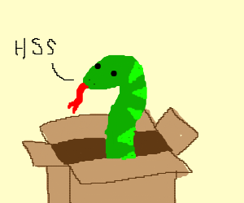

# Python Cheatsheets, vol.1: Introduction to the Anaconda very basics

Python provides a versatile set of tools for programming beginners. Mastering the basics, including comments, variables, math operators, and functions, sets the foundation for more advanced coding concepts. Keep exploring, practicing, and building to enhance your Python skills!

As the first part of our **Introduction**, we'll focus on the following learning path for our cheatsheets:

1. **Basic syntax and data types** (integers, floats, and strings).
2. **Variables and assignements**.

Let'sss go!

<p align="center">
  
</p>

---

## Table of Contents

1. [📝 Comments](#comments)
    * [Inline Comments](#inline-comments)
    * [Multiline Comments](#multiline-comments)
    * [Comments in Code](#comments-in-code)
2. [📊 Variables](#variables)
    * [Variable Naming Rules](#variable-naming-rules)
3. [➕➖✖️➗ Math Operators](#math-operators)
    * [Addition](#addition)
    * [Subtraction](#subtraction)
    * [Multiplication](#multiplication)
    * [Division](#division)
    * [Expression Examples](#expression-examples)
    * [More Examples](#more-examples)
4. [🔄 Augmented Assignment Operators](#augmented-assignment-operators)
    * [Increment and Decrement](#increment-and-decrement)
    * [Examples](#augmented-assignment-examples)
5. [🦄 Walrus Operator](#walrus-operator)
    * [Assignment within Expressions](#assignment-within-expressions)
    * [Examples](#walrus-operator-examples)
6. [🎲 Data Types](#data-types)
    * [Integers](#integers)
    * [Floating-point Numbers](#floating-point-numbers)
    * [Strings](#strings)
7. [🧬 Concatenation and Replication](#concatenation-and-replication)
    * [String Concatenation](#string-concatenation)
    * [String Replication](#string-replication)
8. [🔄 Functions](#functions)
    * [Defining Functions](#defining-functions)
    * [Calling Functions](#calling-functions)
9. [🖨️ The print() Function](#the-print-function)
    * [Basic Usage](#basic-usage)
    * [The `end` Keyword](#the-end-keyword)
    * [The `sep` Keyword](#the-sep-keyword)
10. [📥 The input() Function](#the-input-function)
    * [User Input](#user-input)
    * [Default Message](#default-message)
    * [Formatted Strings](#formatted-strings)
11. [📏 The len() Function](#the-len-function)
    * [Evaluating Length](#evaluating-length)
    * [Test of Emptiness](#test-of-emptiness)
12. [🏛 License](#-license)

---

## 📝 Comments

Comments in Python are used to explain code and make it more readable. They can be inline or multiline.

### Inline Comments

An inline comment is a comment on the same line as a statement. It is indicated by the `#` symbol.

```python
# This is an inline comment
result = 1  # initialization
```

### Multiline Comments

Multiline comments are used for longer explanations. They start and end with three single quotes (`'''`).

```python
'''
This is a
multiline comment
'''
```

### Comments in Code

Comments can also be added to the end of a line of code.

```python
result = 1  # initialization
```

---

## 📊 Variables

In Python, variables are used to store data values. Variables are created when they are assigned a value.

### Variable Naming Rules

1. It can be only one word.

```python
name = 'John'
# valid

full_name = 'John Doe'
# valid
```

2. It can use only letters, numbers, and the underscore (`_`) character.

```python
user_age = 25
# valid

user@age = 25
# invalid
```

3. It can’t begin with a number.

```python
var_23 = 'hello'
# valid

23_var = 'hello'
# invalid
```

4. Variable names starting with an underscore (`_`) are considered as "unuseful".

```python
_secret_code = '12345'
# valid

_ = 'This variable is not used'
# valid but discouraged
```

---

## ➕➖✖️➗ Math Operators

Math operators perform operations on numeric values. They include addition (`+`), subtraction (`-`), multiplication (`*`), and division (`/`).

### Addition

The addition operator (`+`) adds two numbers.

```python
result = 2 + 3
# 5
```

### Subtraction

The subtraction operator (`-`) subtracts the right operand from the left operand.

```python
result = 5 - 2
# 3
```

### Multiplication

The multiplication operator (`*`) multiplies two numbers.

```python
result = 3 * 4
# 12
```

### Division

The division operator (`/`) divides the left operand

 by the right operand.

```python
result = 8 / 2
# 4.0
```

### Expression Examples

Expressions can include multiple operators and operands. The order of operations is followed.

```python
result = 2 + 3 * 6
# 20

result = (2 + 3) * 6
# 30

result = 2 ** 8
# 256

result = 23 // 7
# 3

result = 23 % 7
# 2

result = (5 - 1) * ((7 + 1) / (3 - 1))
# 16.0
```

### More Examples

```python
a = 10
b = 3

sum_result = a + b
# 13

difference_result = a - b
# 7

product_result = a * b
# 30

division_result = a / b
# 3.333...
```

---

## 🔄 Augmented Assignment Operators

Augmented assignment operators combine an arithmetic operation with variable assignment. They perform the operation and assign the result to the variable.

### Increment and Decrement

Increment and decrement are common operations where a variable's value is increased or decreased by 1.

```python
count = 0
count += 1  # Increment by 1
# count is now 1

total = 5
total *= 2  # Multiply by 2
# total is now 10
```

### Examples

```python
value = 10

value += 5
# value is now 15

value -= 3
# value is now 12

value *= 2
# value is now 24

value /= 3
# value is now 8.0
```

---

## 🦄 Walrus Operator

The Walrus Operator (`:=`) allows assignment of variables within an expression while returning the value of the variable.

### Assignment within Expressions

```python
message := "Python Basics"
# 'Python Basics'

is_true = True
print(result := "Success") if is_true else print("Failure")
# Success

print(name := "John")
# John
```

The Walrus Operator, or **Assignment Expression Operator**, was firstly introduced in 2018 via [PEP 572](https://peps.python.org/pep-0572/) and then officially released with **Python 3.8** in October 2019.

> [!NOTE]
> [PEP 572](https://peps.python.org/pep-0572/) provides the syntax, semantics, and examples for the Walrus Operator.

---

## 🎲 Data Types

Data types specify the type of values that variables can hold. In Python, the main data types are integers, floating-point numbers, and strings.

### Integers

Integers are whole numbers without a fractional part.

```python
integer_number = 42
negative_integer = -10
```

### Floating-point Numbers

Floating-point numbers are numbers with a decimal point or in exponential form.

```python
float_number = 3.14
negative_float = -0.5
```

### Strings

Strings are sequences of characters, enclosed in single or double quotes.

```python
text = 'Hello, Python!'
multiline_text = """This is a multiline
string in Python."""
```

---

## 🧬 Concatenation and Replication

String concatenation combines two strings, while string replication repeats a string multiple times.

### String Concatenation

```python
result = 'Python' + ' Basics'
# 'Python Basics'
```

### String Replication

```python
phrase = 'I love ' + 'Python! ' * 3
# 'I love Python! I love Python! I love Python! '
```

---

## 🔄 Functions

Functions are blocks of reusable code. They receive input, perform actions, and return output.

### Defining Functions

Functions are defined using the `def` keyword, followed by the function name, parameters, and a colon.

```python
def greet(name):
    """
    This function greets the user.
    """
    print(f"Hello, {name}!")
```

### Calling Functions

Functions are called by using the function name followed by parentheses and passing any required arguments.

```python
greet('Alice')
# Hello, Alice!
```

---

## 🖨️ The print() Function

The `print()` function writes the value of the argument(s) it is given. It handles multiple arguments, floating-point quantities, and strings.

### Basic Usage

```python
print('Greetings!', 'Welcome', 'to Python Basics!')
# Greetings! Welcome to Python Basics!
```

### The `end` Keyword

The `end` keyword can be used to avoid the newline after the output or end the output with a different string.

```python
phrase = ['printed', 'with', 'a', 'dash', 'in', 'between']
for word in phrase:
    print(word, end='-')
# printed-with-a-dash-in-between-
```

### The `sep` Keyword

The `sep` keyword specifies how to separate objects if there is more than one.

```python
print('cats', 'dogs', 'mice', sep=', ')
# cats, dogs, mice
```

---

## 📥 The input() Function

The `input()` function takes input from the user and converts it into a string.

### User Input

```python
name = input('What is your name? ')
print(f'Hi, {name}!')
```

### Default Message

```python
fav_language = input('What is your favorite programming language? ')
print(f'Nice choice! {fav_language}')
```

---

## 📏 The len() Function

The `len()` function evaluates to the integer value of the number of characters in a string, list, dictionary, etc.

### Evaluating Length

```python
string_length = len('Python Basics')
# 13

list_length = len([1, 2, 3, 4, 5])
# 5
```

> [!NOTE]
> Test of emptiness of strings, lists, dictionaries, etc., should not use `len` as it prefers direct boolean evaluation.

### Test of Emptiness

```python
my_list = [1, 2, 3]

# bad
if len(my_list) > 0:
    print("This list is not an empty one!")

# good
if my_list:
    print("This list is not an empty one!")
```


**[⬆ Back to Index](#table-of-contents)**

**[🔙 Back to Cheatsheets Index](../../README.md)**

---

## 🏛 License

Although I am the owner of the examples provided (always taking into account previous examples that I got to know during my formation, of course), I would want to send some huge thanks to [Olivia Redanz](https://drawception.com/player/542622/olivia-redanz/) for her fantastic illustration! Oh, and remember that you can make the Dinosaur extremely happy if you...
<br />

---

<h1 align="center">
  <a href="https://karamazfolio.xyz/">
</h1>
<h2 align="center">
  <a href="https://www.buymeacoffee.com/JuditKaramazov" target="_blank"></a>
</h2> 
