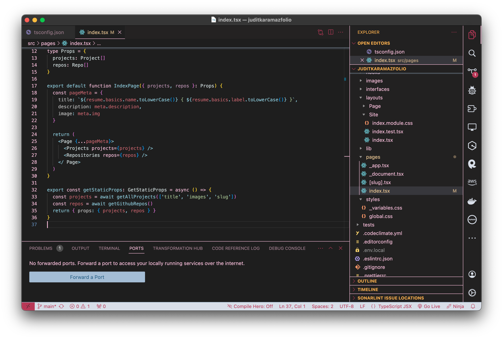
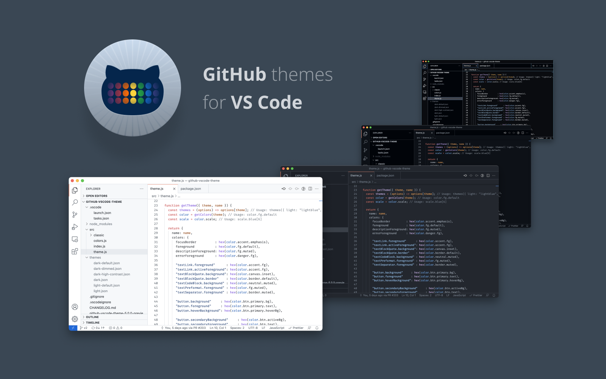

# Your IDE & you: An accessible introduction to integrated development environments

  

---

## Table of Contents

* [🚪 What is an IDE?](#-what-is-an-ide)
  * [❓ Why should you use an IDE?](#-why-should-you-use-an-ide)
    * [🌟 Common features](#-common-features)
  * [💻 IDE vs Code Editor](#-ide-vs-code-editor)
* [📊 Types of IDEs](#-types-of-ides)
* [👉 Choosing your fighter](#-choosing-your-fighter)
  * [🔍 Factors to consider](#-factors-to-consider)
    * [👨‍💻 What kind of developer are you?](#-what-kind-of-developer-are-you)
    * [🎯 Needs & Scope](#-needs--scope)
    * [💰 Pricing](#-pricing)
* [⛰️ Top IDEs](#-top-ides)
  * [🆓 Free IDEs](#-free-ides)
    * [🧰 Visual Studio Code](#-visual-studio-code)
    * [🐍 PyCharm](#-pycharm)
    * [📝 Sublime Text](#-sublime-text)
  * [💵 Paid IDEs](#-paid-ides)
    * [🌩️ WebStorm](#-webstorm)
  * [📜 Complete list](#-complete-list)
    * [🌐 All-purpose IDEs](#-all-purpose-ides)
    * [🔤 Language-specific IDEs](#-language-specific-ides)
    * [🎮 Game Development IDEs](#-game-development-ides)
    * [📱 Mobile App Development IDEs](#-mobile-app-development-ides)
    * [🚀 Web Development IDEs](#-web-development-ides)
* [🏡 Customization I: Make it feel like home](#-customization-i--make-it-feel-like-home)
  * [🎨 Themes](#-themes)
* [🧩 Customization II: Extensions](#-customization-ii--extensions)
  * [🔝 Top-notch enhancements](#-top-notch-enhancements)
* [🏁 One last note](#-one-last-note)
* [🏛 License](#-license)

---

# 🚪 What is an IDE?

This is one of the first doubts you'll encounter as soon as you start coding - and not without reason. Truth being said, understanding what an _Integrated Development Environment (IDE)_ is becomes crucial when you begin coding, but not all the descriptions you'll find will make the real meaning any clearer in your head. 

In general terms, an IDE is **a comprehensive software suite that provides essential tools for coding, debugging, and building software applications** in a single integrated platform or GUI. Although I am capable of saying this now, back in the day I would have read this exact same description, remained silent, and nodded in confusion; that's why we are going to find a more approachable way of describing what an IDE truly **is**.

💡 In simpler words, **an IDE is an application making it easier for developers to "write", edit, visualize, and eliminate the errors of their own applications** - this is, the ones _they_ are developing! Needless to say, before you start to learn a language, you'll need **somewhere to write your programs**, right? That "special place" is the IDE. Now, in order to make it more graphic, let's have a look at the following screenshot:

  

The above window, which belongs to an IDE called **Visual Studio Code**, displays different elements that are essential for all developers:

1. A `text editor` in the middle with line numbers on the left side. 
    - **That text is our code**. As you can see, our "IDE" or "application for making applications" **colors different parts of the code to make it easier to understand**, as programming languages have their **unique syntax**. This text editor will even display **warnings, errors, and other code-related feedback** allowing us to find and understand some problems. Piece of cake! (_Maybe I'm exaggerating a little bit here..._)
  > [!TIP]
  > If you need a clearer image of what we just described, imagine using a text editor like Microsoft Word, and then being able to highlight the verbs, nouns, prepositions, etc. in different colors. Wouldn't that make things more intuitive and visual for people who are starting to learn a new language? This is more or less the same!

2. On the right side, the IDE `lists all the files we created`. 
    - This way, it gets **easier to organize and access** different parts of the code.

3. Also on the right side, a `sidebar with different icons` representing, most of the time, **extensions and plugins**.
    - You will be able to search, install, and configure extensions in order to customize your development environment. There are plenty of **special tools or extensions** that will make the process of creating applications even **smoother**, such as **syntax highlighting**, **code completion**... but we'll soon come to that.
  > [!NOTE]
  > By default, you'll find this sidebar on the left side instead, but you can customize its position depending on your preferences!

4. `The Terminal`, found at the bottom of the IDE window.
    - The terminal will be particularly useful for tasks such as running scripts, installing dependencies, or interacting with version control systems. Also, you will find some other categories (e.g.: "Debug Console") displaying messages related to the debugging process, in this case. 
  > [!WARNING]
  > Although we are just getting started, keep in mind that is always important to view these messages generated during code execution!

5. `Debugging Tools`, also on the sidebar located on the right side.
    - See that little `bug icon` over there? By accessing these tools (this is, the so-called `Debugging Tools`), you will get controls for setting breakpoints, stepping through the code, inspecting variables... Do not worry if it sounds quite otherworldly right now, though - just don't forget that it exists and that the time will come for you to set this as a priority!

For now, this is all you need to know about what an IDE truly is: a **software application** that combines, in one place, **all the tools needed** for a software development project. On a more basic level, they provide **interfaces for users to write code, organize text groups, and automate programming redundancies**.

> [!IMPORTANT]
> If you are an Evangelion lover, or if you simply like the color palette displayed on the previous screenshot, you can download the themes that I created either in the [Marketplace](https://marketplace.visualstudio.com/items?itemName=tecnomazov.evas-code), either in [GitHub](https://github.com/JuditKaramazov/TCA-EVASCode) directly!

## ❓ Why should you use an IDE?

After exposing some of the main functionalities of our integrated development environments, we could safely confirm that **one of the main reasons** for developers to use an IDE is, without doubt, the **pursuit of productivity**. 

 

  

 

However, since we're getting started with these new concepts and applications, let's break their features down before proceeding any further, which might hopefully provide us with a better understanding of why we should (or shouldn't) use an IDE.

### 🌟 Common features

 1. **Efficiency:**
     - **Coding Assistance:** IDEs go beyond basic text editors by offering intelligent coding assistance. Features like **autocompletion, syntax highlighting, and real-time error checking** empower developers to write code more efficiently and with fewer errors.
  
     - **Integrated Tools:** From version control systems to build and deployment tools, developers can streamline their workflows, **reducing the need to juggle between different applications**. Everything's **right here**, guys!

2. **Error Prevention and Debugging:**
    - **Real-time Feedback:** IDEs **continuously analyze your code**, providing **immediate feedback on potential errors**. This proactive approach minimizes the chances of introducing bugs and accelerates the debugging process.
  
    - **Integrated Debugging:** Although you won't understand much about it at the beginning (_happened to the best of us, no worries_), what we understand as `debugging` is the **process of locating and removing coding mistakes in a computer program** - which can take as much time as writing code. **Syntax errors, bad logic, typos**... although `console.log` will become your good-to-go tool, as soon as your app grows and starts to get more complex, you'll realize that understanding options such as `"Run and debug"` one integrated into IDEs like VSCode is as important as learning a programming language itself. I know what you are thinking, and yes: all of this information sounds quite overwhelming at the moment, so please, [keep some explanations](https://www.freecodecamp.org/news/what-is-debugging-how-to-debug-code/) regarding the matter at hand.

3. **Code Navigation and Exploration:**
    - **Intuitive Navigation:** IDEs empower developers to **smoothly navigate large codebases**. Features like `"Go to Definition"` or `"Find References"`, for instance, **facilitate code exploration**, ensuring developers can understand, modify, and extend existing codebases without breaking their heads _that much_.

4. **Consistency and Collaboration:**
    - **Coding Standards Enforcement:** IDEs can **enforce coding standards and style guidelines**, promoting **consistency** across projects and team members. This ensures that the codebase **remains cohesive and comprehensible**, even in collaborative environments.
  
    - **Collaboration Features:** Speaking of which: with collaborative tools and integrations, developers can **work seamlessly in teams** thanks to **shared debugging sessions, code reviews, real-time collaboration platforms**...

5. **Customization:** 
    - **Extension Ecosystem:** IDEs, such as Visual Studio Code, boast a **rich ecosystem of extensions**. These modular add-ons allow developers to customize their environment, incorporating features that align with their specific needs and preferences.
  
    - **Versatility:** Whether you're a beginner or an experienced developer, IDEs provide a **versatile platform that caters to a spectrum of programming languages, frameworks, and project types**. This adaptability ensures that developers can leverage the same powerful tools across various contexts.

6. **What else?**
    - **Dependency importing**, **test runners**, **refactoring** (mistake-free renaming is a killer), **version control integration**... No matter if these concepts may feel a bit odd right now, the fact that you can so easily navigate to the code for reference, implement methods from an interface just with a couple of clicks, check for errors without losing _that much of your mental sanity_, or paste code and find it automatically to the right tab thanks to smart typing is an absolute game-changer.

💡 Thanks to all these ingredients in the form of "features", you will have way **more time to think about your own code and architecture, and less about dealing with complex file systems, bad formatting, lack of documentation**, etc. 

The way IDEs can understand your code is unpaired these days. The fact that a single tool centralizes a lot of the functions you will perform while programming will **dramatically reduce the process friction reducing your productivity**, and this provided convenience is the reason why most people choose them over `text editors`.

## 💻 IDE vs Code Editor

Needless to say, we were not born yesterday - and neither did our precious IDEs. _Let's now go back to the very roots of civilization..._

 

  

 

Long story short, in the early days of software development, programmers used **simple text editors** to write code, which provided **basic functionality** for creating and editing plain text files. Do you remember the old (yet part of every version of Windows) [Notepad](https://en.wikipedia.org/wiki/Windows_Notepad)? That's a great example of the way everything started. No matter their lightweightness nor the essential functionalities text editors provided for basic editing, as software development became more complex, the **need for tools that could streamline the development process grew**; that fact allowed _Integrated Development Environments_ to emerge, combining various tools into a single, cohesive environment, and including features like project management, code editing, and debugging tools. The improvement of Graphical User Interfaces, the specialization in supporting specific programming languages, and the expansion of features until the present came after, of course, and in recent years, **modern IDEs have gained popularity upon text editors**.

This doesn't mean that no one is using them anymore, though. Despite the availability of powerful integrated IDEs, **many developers choose to use text editors for various and diverse reasons**, such as:

1. **Lightweightness and speed**.
2. **Simplicity**.
3. **Portability**.
4. **Quick launch**.
5. **Learning curve**.

For many, text editors feel more accessible both to beginners or those who prefer a simpler toolset allowing them to work on **specific tasks**, such as code review or diffing files. Personally, I used to find them **a great way to encourage good coding practices**, such as **understanding file structures, writing code from scratch, and managing files manually**. Truth said, however, I still chose to transition to an IDE that offered more advanced features and better support for complex development tasks - but that's all about **preferences**. Although starting with a text editor provides a solid foundation for understanding the basics of coding and programming concepts, it is also important to understand the **complexity and scope of your own projects**. Undoubtedly, text editors might feel less overwhelming since they **tend to have a lower learning curve**, but the choice between a text editor and an IDE will **still depend on your needs only**.

Just in case you would want to quickly check some of the main differences between the two of them, here's a little table summarizing some of their main features:

| Feature 🌟                   | Text Editors                          | IDEs                                     |
|---------------------------|---------------------------------------|------------------------------------------|
| **Scope**                 | Basic text editing                    | Comprehensive development environment    |
| **Complexity**            | Lightweight and simple               | Feature-rich and more complex            |
| **Speed**                 | Faster startup and usage              | Longer startup time, but robust features |
| **Project Management**    | Limited or basic project support     | Advanced project organization tools     |
| **Debugging**             | Limited or no built-in debugging      | Integrated debugging tools              |
| **Language Support**      | Broad support for various languages   | Specialized for specific languages       |
| **Extensibility**         | Basic extensibility through plugins  | Extensive plugin and extension support   |
| **Build and Compilation** | Limited or no built-in build tools    | Built-in build and compilation features  |
| **Version Control**       | Limited or no integrated support      | Integrated version control (e.g., Git)  |
| **Graphical UI**          | Minimal or none                       | Graphical interfaces for ease of use    |
| **Examples**              | Notepad, Sublime Text, Atom           | Visual Studio, Eclipse, IntelliJ IDEA   |

> [!TIP]
> Quite big words we've been using lately, eh? `Debugging`, `Git`, `environment`... How about having a look at this amazing dictionary called [DevTerms](https://devterms.io/), then? It saved my life more often than I'd want to admit! 

---

# 📊 Types of IDEs

Congratulations, guys: we've survived this far already, and believe me when I say it's not easy at all. In case you are wondering, we all had to start at some point, and regardless of the position we are occupying now, we _indeed remember_ how much we struggled (still do, sometimes) with all these concepts, ideas, tools, and refined artifacts of this Modern Era.

 

  

 

Now that we've been introduced to some of the very basics, though, it would be necessary to establish a basic distinction between the **types of IDEs** you'll find online, as their differences might involve some extra factors to consider before choosing the development environment truly fitting your needs. Of course, IDEs **come in diverse forms**, and while some are designed to work for a **specific language**, some others are **targeted to a particular platform**, like mobile devices. We'll get more into detail later on, but for now, let's simply check the main options we have at hand:

| Type                          | Description                                                                                                                   | Examples                                          |
|-------------------------------|-------------------------------------------------------------------------------------------------------------------------------|---------------------------------------------------|
| **Cloud IDEs** ☁️               | Accessed through the internet, it is ideal for quick access and collaboration, especially when working on multiple devices. Good for quick access and works on any computer!              | AWS Cloud9, Gitpod, Replit                        |
| **Database-Specific IDEs** 🛢️    | Designed for working with databases efficiently and smoothly, as they help in creating and managing them. Can be used online or on your computer.            | MySQL Workbench, Oracle SQL Developer             |
| **Desktop IDEs** 🖥️             | Configured on your computer. Customizable and great for offline work, they are perfect for in-depth programming projects on your personal machine.                        | Eclipse, Microsoft Visual Studio, Netbeans        |
| **Game Development IDEs** 🕹️    | Specifically designed for creating games, they include tools for graphics, sound, and game logic. Can be used on your computer or online. | Unity, Unreal Engine, Godot, GameMaker Studio      |
| **Mobile App Dev IDEs** 📱      | Made for mobile apps, they include refined features for testing, developing, and building your own applications. Can be used online or on your computer.                       | Android Studio, Flutlab.io                        |

If you are still uncertain about the types listed above, remember that we'll now **break down all the factors you should keep in mind before choosing any specific type of IDE**. Buckle up, dear reader! 

---

# 👉 Choosing your fighter

If you ask me today what's my chosen fighter, I wouldn't hesitate for a single second - just like I wouldn't when choosing my starter in Pokémon after so many years being a `🔥 Fire Adept 🔥`. Even this selection would answer to my subjective evaluation criteria, though, and this means that whatever I might say here relies on my opinion and perceptions. Since every single suggestion you'll find out there will be a  judgment influenced by a similar personal bias, **remember to keep all this information in mind just as a base for you to build your own resources, techniques, and favorite tools**. In the end, all IDEs may be equally valuable and beneficial for your workflow; this is nothing but a guideline.

 

  

 

That said, and in order to make this exposition of possibilities more approachable, let's start with the very basics to take into account.

## 🔍 Factors to consider

If we were to choose the two key considerations that will significantly influence your future coding journey, these are:

- Your operative system.
- The language you'd want to learn.

Now, let's delve deeper into these notions.

1. **Operating system compatibility:**
   - It's crucial to **select an IDE that aligns with your operating system**: be it the familiarity of Windows, the elegance (_but no customization..._) of macOS, or the versatility of Linux. That's completely up to you; whatever the case, **compatibility ensures that your chosen IDE functions seamlessly within your preferred ecosystem**, as this fact will not only provide you with a smooth and efficient coding experience but will also enhance your overall development workflow. 

   - TL;DR: **Consider how well the IDE integrates with the specific features and functionalities of your operating system**.

2. **Language alignment:**
   - Before selecting an IDE, **identify the programming language you aim to master**. Different IDEs offer specialized features and tools depending on specific languages, and they will definitely contribute to a **more comfortable and productive coding experience**.

   - If you are willing to venture into **multiple programming languages**, opting for an IDE with broad language support ensures versatility, as these IDEs deliver robust features without compromising the overall performance.

By understanding the critical role of operating system compatibility and language alignment, you lay a strong foundation for selecting an IDE that not only meets your technical requirements but also aligns with your coding aspirations. Worry not, though: soon enough, **you'll have a much better understanding of what you need from your development environment**, but at this specific moment of your learning path, all these questions are essential in order to facilitate the journey to mastery.

 

  

 

Don't play your own cards against yourself. It's only not about _magically finding_ something fitting your needs but _knowing_ what is it that you truly need. Then, you'll be capable of making decisions accordingly!

Speaking of "decisions", needs, and secrets of this sector...

### 👨‍💻 What kind of developer are you?

That's the next matter we'll focus on before choosing a specific IDE: our "developer profile". Defining our coding identity is crucial; are you...

- A mobile app developer?
- A video game enthusiast? 
- A backend _maestro_? 

While it is indeed possible to choose your fighter before fully defining your coding profile, identifying our specific needs might simplify our final decision, as different IDEs are optimized for various development scenarios that might (or not) resonate with your identity. Your journey is going to be mostly shaped by your unique answer, which means that prior to embarking on this adventure, **considering our role or specialization should be one of our priorities**. By doing so, you will be capable of:

1. **Choosing a focused learning path**.

  - Knowing what you want to achieve will allow you to follow **a more focused and structured learning path**. While jumping into the abyss or aimlessly exploring various topics might be equally interesting (depending on the profile, at least), prior knowledge will allow you to **direct your efforts, energy, and time toward goals that are truly relevant** to you and your needs.

2. **Efficiently developing your skills**.

  - Learning a language "just because" or out of context is a great experience; eventually, it might lead to greater options, reconsiderations, or solid thoughts making you feel that you made the right decision. However, **different coding goals require different skill sets**. Choosing and learning a language within the context of your coding profile, wishes, and aspirations, will allow you to focus on **mastering the aspects of the language that directly contribute to your domain expertise**, which means that **you'll avoid unnecessary concepts that may not be applicable** to your chosen field.
  The field itself is irrelevant; they all are _great._ As each path demands specific skills, though, knowing your goals beforehand will give you the time to focus on developing the skills that directly contribute to your chosen domain. In this sector, that, my dear, is essential!

3. **Enhancing your motivation**.

  - Clearly **defined goals provide a sense of purpose** and motivation that might vanish into thin air if you decide to immerse yourself in this field without previous references. When you have a vision of what you want to accomplish, you're more likely to stay engaged and persist through challenges - and there will be obstacles to overcome. Tons of them. Coding is fundamentally about problem-solving, after all, but **do not create unnecessary problems by not defining your goals at the proper time**.
  Find something that **resonates with your interests and persona** since it's more enjoyable to learn and work with a language that aligns with your passion and coding profile rather than going through this journey without the proper enthusiasm or motivation.

4. **Focusing on targeted projects**.

  - Defining your profile early will help you envision the types of projects you'd like to work on - and _that_ part is going to be simply amazing! Sometimes bigger, sometimes simpler, more or less complex; the **best way to gain practical experience is by working on projects**, and the only tool allowing you to properly define them is the deep understanding of what it is _exactly_ that you'd want to achieve. Depending on the scope and scale of such projects, you might need an IDE that can handle large, multiple files, and complex dependencies; on the other hand, working on a small or simple project with few files and dependencies would be easier with an IDE that is lightweight, fast, and easy to use.
  Do not worry if your first projects are relatively small, though. Keep this in mind: all these projects are the previous steps leading to the project you truly dreamt of, but it's all about practicing, learning, and improving before getting there. Don't give up, skeleton!

5. **Optimizing your toolset and resource selection**.

  - Time and resources are limited. Defining your objectives, however, will help you identify the most relevant roadmaps, tutorials, courses, tools, and IDEs, as knowing your domain gives you the **proper base to select the material that caters specifically to the requirements** of your chosen field. 

Don't be overwhelmed by uncertainty, though; we do **love and welcome multifaceted developers**. If you haven't defined your profile yet (spoiler: that's _completely normal_, guys!), if you are simply exploring various domains, or if you have a diverse skill set, **consider IDEs that offer versatility**, then. Several platforms support a wide spectrum of development types, and they do **provide a comprehensive toolset for plenty of roles and languages**.

 

  

 

While it's great to have some basic ideas well-defined in our heads, it is **also essential to understand that we all had to start "somewhere"**, and if you get to ask several developers, you might be surprised to learn how _odd_ their origins were. **If you don't try, you will never know**, so if you are still hesitating, **find languages closely related to the spheres you love**; the rest will come with time.

### 🎯 Needs & Scope

As we mentioned in the previous section, understanding your needs or the kind of project you require should be your priority before picking any specific IDE. Then, recognize the features critical to your project. What are the ones you need to have in your _integrated development environment_? Which IDEs provide such tools? As all of these environments are different, **you might encounter several features to be helpful** for you whereas **others might not be so valuable at all**. If you have no specific project in mind and simply want to embark on this journey, ask yourself similar questions: **what is my goal?** Does achieving such a goal require extremely sophisticated tools? Could I get there with a simpler IDE instead? Would the decision compromise the final or not really?

Let's take it even further by imagining two possible scenarios.

1. **Scenario 1: Grand Enterprise Expedition** (_I am terrible at titles, guys. Excuse me for that_).

  - Imagine that you are working on a large enterprise application that includes many layers, modules, and components. Given the case, **you may want to use an IDE that has features such as code navigation, version control, refactoring, testing**, etc., as these features wouldn't be desirable anymore but simply essential. 

2. **Scenario 2: Being a Student is Killing my Artistic Soul**.

  - What if you are getting started with a university _Introduction to Programming_ course (starring the very basics of HTML and CSS) you'd want to get rid of as soon as possible? In this educational scenario, simplicity and accessibility would take precedence compared to the scenario we imagined before, am I right? In this case, opting for an IDE that is **accessible, user-friendly, aligned with the basics, and free** would definitely benefit learners who would want to master the fundamental building blocks of the sector without the burden of unnecessary complexity.

Whatever your specific case is, remember that the **unique needs and scope of your projects and goals will ultimately dictate your feature checklist**, and by extension, the IDE providing you with the best options.

### 💰 Pricing

There is no exception when it comes to IDEs: there are numerous available in the market that are free of cost, while some of them, especially the ones including special features, exist under a paid version.

Let's not forget the existence of:

1. **Free and open source IDEs**.

  - You'll be able to download and use them without paying any fees or licenses, and believe it or not, there are quite some great IDEs that are completely free out there - the one that I'm using right now included. Quality coding without breaking the bank? Sign me up.

2. **Paid and proprietary IDEs**.

  - For these ones, you'll have to purchase or subscribe to them to access their full features and functionalities.

If you are looking for a cost-effective option, then you can go for the open-source IDE. However, if you need features and customer support to help you, then you might want to consider paying for the packages.

 

  

 

These days, there is **absolutely no need** to choose the most expensive options, as "pricey" doesn't necessarily translate into "better". If you want a bit of advice, I would suggest **keeping these paid options in mind and asking for a license in your workplace** since it's quite likely they will accept to get it for you if that's the IDE you feel more comfortable with. Capitalize your options, guys!

> [!IMPORTANT]
> Now, a recap. Always consider `your operative system` -> `the language you'd want to learn` -> `the type of developer you'd want to be` -> `the scope and specific needs of your project or goals` -> `the Market and its unbearable prices`. If that's clear in your mind, then you definitely passed the exam!

---

# ⛰️ Top IDEs

With so many options available, it can be indeed difficult to know what features are most important and which IDE will best suit your needs. Independently of that, here are my preferred options in terms of **features**, **performance**, **integrated tools**, **customization**, and **accessibility**, just in case you will find them useful as you start walking through the valley of code.

## 🆓 Free IDEs

> [!WARNING]
> In Sublime Text's case, their text editor is not fully free; instead, there is an evaluation version available that will still satisfy some basic needs. When I started programming, I used it for quite a long time without encountering any sort of problem, so... let's keep it cheap!

### 🧰 Visual Studio Code

 

  
   
  <i>Visual Studio Code is my father</i>

 

Now, the question: what makes [Visual Studio Code](https://code.visualstudio.com/) so great? Time to keep this explanation simple.

_Visual Studio Code_ (or simply _VSCode_), **a cross-platform code editor for writing web and cloud applications**, is indeed one of the most popular source code editors used by programmers, and not without reason. It’s `fast`, `lightweight`, and `customizable` (I highly doubt you'll find two of them looking exactly the same), yet these factors do not compromise at all how `powerful` it _also_ is, as its ability to adapt to diverse programming scenarios with easiness is quite mesmerizing. In short, VSCode will offer you:

1. **Lightweight and fast IDE**.
2. **Language support**.
3. **An amazingly-good extension ecosystem**.
4. **Cross-platform compatibility**.
5. **Git integration**.
6. **Intelligent code editing features**.
7. **User-friendly interface and customization options**.
8. **Regular updates and improvements**.
9. **Numerous features**.
10. **Copilot**.

This source editor has come a long way to become one of the most popular IDEs for programmers thanks to its versatility, rich feature set, the strong support it _still_ receives from the developer community, its performance, and its captivating way of making things look simple.

TL;DR - Just **go download VSCode**, guys. As someone who gave several IDEs a try without feeling quite comfortable in any of them, I simply can't recommend this one _enough._ It's great. Not only great: it is _awesome._ Why are you still reading, even? Go get it!

### 🐍 PyCharm

 

  
   
  <i>PyCharm quite rules</i>

 

_Spyder, Jupyter, VSCode_... Although nowadays many programmers opt for Python to **build software applications with a concise and readable code base**, not every integrated development environment feels the same. [JetBrains](https://www.jetbrains.com/), however, knows a couple of things about refined IDEs and "building software where you can enjoy building yours", and [PyCharm](https://www.jetbrains.com/pycharm/) is definitely no exception.

Whether you’re an experienced developer or just starting your journey with the language, the JetBrains IDE for Python, PyCharm, **provides everything you need out of the box to code faster and smarter**. Now, if any of these are worth your attention:

1. **Cross-technology development**.
2. **Smart navigation and refactoring**.
3. **Built-in test runner and coverage**.
4. **Database tools and SQL support**.
5. **Version control integration**.
6. **Remote development capabilities**.
7. **Intelligent Python assistance (code completion, code inspections, on-the-fly error highlighting...)**.
8. **Integration with Jupyter Notebook, interactive console, and Anaconda support**.

Then, it means that these features not only collectively contribute to making PyCharm a preferred (and _charming_) choice for developers, but they'll be absolute killers for **you** as well.

### 📝 Sublime Text

 

  
   
  <i>Write me like one of your Sublime Text(s)</i>

 

Sometimes, it's all about finesse, and although switching to IDEs was the natural step for most of us, no one can deny that certain setup processes are as tedious as the lack of speed and simplicity.

Just in case you are wondering: as powerful and precise as it is, [Sublime Text](https://www.sublimetext.com/) **is not an IDE** but a beast of a **text editor**. Now, and before you ask me why I decided to mention one in this personal list, allow me to remind you that **our needs are unique to us**, and just like it happened to me before definitely switching to VSCode, I first started coding thanks to Sublime Text - and _automatically_ fell in love with it. The reasons are rather simple:

1. **Great and faster-than-light typing experience**.
2. **Quick installation**.
3. **Powerful search and replace functionalities**.
4. **Multiple selections and editing**.
5. **Cross-platform compatibility**.
6. **Cross-file editing and navigation**.
7. **Extensibility with packages and plugins**.
8. **Distraction-free mode** (this one is _essential_, in my opinion).
9. **Text snippets**.
10. **Stunning speed and performance**.

Remember that no one can question our priorities and preferences, and giving such a powerful text editor a try might be a great decision before getting started with an IDE. Hopefully, you won't even want to switch!

## 💵 Paid IDEs

Here's a warning now that a "_money, money, money_" moment suddenly appeared. Do you have your wallet ready? I genuinely hope it's the case now that we're going to mention our dearly beloved...

### 🌩️ WebStorm

 

  
   
  <i>WebStorm could be my father if he had money</i>

 

Our "top IDEs" list wouldn't be complete without the most beautiful creation that JetBrains ever shared with us: the **incredibly robust**, **fast**, and **flexible** [WebStorm](https://www.jetbrains.com/webstorm/). 

As I mentioned earlier, VSCode has a wide range of extensions, themes, and possibilities I couldn't afford to live without these days, but the verdict after comparing both VSCode and WebStorm simply _depends_. As a front-end developer myself, I consider the two of them great options, but I'd suggest JetBrains' beautiful child **only if you are a professional developer who needs advanced functionality**. Ultimately, the choice is entirely up to you, though, but let's not forget that WebStorm might gift you with:

1. **Code quality analysis and refactoring**.
2. **Smart navigation and search**.
3. **Built-in tools for modern web development**.
4. **Advanced coding assistance**.
5. **Live editing and preview**.
6. **Incredibly-smooth integration with version control systems**.
7. **Excellent built-in debugger**.
8. **Language-specific features**.
9. **Great Webpack integration**.

The key advantage to WebStorm, in my opinion, is that it is a **full-blown IDE for a great out-of-the-box experience**. However, due to the memory and processing power consumption, its resource usage will depend on your specific hardware and the size and complexity of the project, and that might be... problematic, depending on your requirements.

Remember what I told you some lines ago, though? **If your workplace offers you a license in order to use it without any restrictions, do not hesitate and give it a try**. Also, let's keep in mind that it is possible to **get a free license** if you fit in any of these roles or scenarios:

- open source projects, 
- students, 
- teachers, 
- classroom assistance or training courses, 
- coding schools,
- bootcamps. 

They also offer an [early access version](https://www.jetbrains.com/webstorm/nextversion/), but make sure you know what you're getting into before regretting it!

> [!WARNING]
> As it's mentioned in JetBrains website regarding their early access version: "You expressly acknowledge that this version of the product may not be reliable, may not work as intended and may contain errors. Any use of the EAP product is at your own risk."

---

## 📜 Complete list

Do you think you are ready for this? Of course, I am still _not that crazy_ to list every single possible IDE around, as I am a mere human being with limited knowledge. However, the options you'll find below are **some of the most interesting and complete ones coming to mind**, both **paid and free** options included. Although you already got to know more about some of the **top IDEs** around, it might be useful to dive deeper into the subject once you start building solid confidence in yourself!

For clarity purposes, allow me to remind you that you'll find the content divided as follows:

- **Adaptable, all-purpose**: IDEs that I consider to be "multi-use", versatile, and flexible enough to deliver a great **balance between their features and capabilities**. Most of them will allow you to **handle multiple programming languages**.

- **Language-specific**: If you're looking for a more **specialized experience**, these IDEs are tailored to specific programming languages. This way, you will work on **Java**, **C/C++**, **Python**, and others in a **smooth and dedicated environment**. Highly recommended for those who aim to master one of the above-mentioned languages.

- **Game development**.

- **Mobile development**.

- **Web development**.

Let's go!

### 🌐 All-purpose IDEs

| IDE's Name | Description | System Support | Pricing |
| ---------- | ----------------------------- | --- | --- |
|  [Visual Studio Code](https://code.visualstudio.com/) | A highly customizable code editor with a wide range of extensions, suitable for various languages and frameworks. | `Mac` `Windows` `Linux` `Online` `Chrome OS`| Free, Proprietary, Open-Source |
|  [Eclipse](https://www.eclipse.org/) | A versatile IDE known for Java development capabilities and an extensive plugin ecosystem. | `Mac` `Windows` `Linux` `BSD` | Free, Open-Source |
|  [KDevelop](https://apps.kde.org/kdevelop/) | A cross-platform IDE supporting C, C++, Python, QML/JavaScript, and PHP. | `Windows` `Linux` `KDE` | Free, Open-Source |
|  [Microsoft Visual Studio](https://visualstudio.microsoft.com/) | An integrated development environment supporting various programming languages, including C++, C#, and more. | `Mac` `Windows` `Online` `.NET Framework` | Free, Paid, Proprietary |
|  [NetBeans](https://netbeans.apache.org/) | An [open-source](https://github.com/apache/netbeans) IDE for creating professional desktop, enterprise, web, and mobile applications with support for Java, C/C++, and dynamic languages such as PHP, JavaScript, Groovy, and Ruby. | `Mac` `Windows` `Linux` `BSD` | Free, Open-Source |
|  [Sublime Text](https://www.sublimetext.com/) | A sophisticated text editor with a focus on code editing, offering a smooth and efficient development experience. | `Mac` `Windows` `Linux` | Paid, Proprietary, Evaluation Version Available |
|  [Vim](https://www.vim.org/) | A highly configurable and efficient text editor often used as an IDE by many developers. | `Mac` `Windows` `Linux` `BSD` `Haiku` `AmigaOS` `OpenSolaris` `MorphOS` | Free, Open-Source |

---

### 🔤 Language-specific IDEs

**C/C++**

| IDE's Name | Description | System Support | Pricing |
| ---------- | ----------------------------- | --- | --- |
|  [CLion](https://www.jetbrains.com/clion/) | A cross-platform C/C++ IDE with code analysis, refactorings, and integrated debugger. As elegant as all their products. | `Mac` `Windows` `Linux` `IntelliJ IDEA` | Paid, Proprietary |
|  [Code::Blocks](http://www.codeblocks.org/) | A free, open-source C/C++ IDE with a simple interface and various features. | `Windows` `Linux` `BSD` | Free, Open-Source |
|  [CodeLite](https://codelite.org) | An open-source, cross-platform IDE for the C/C++/PHP and Node.js programming languages. | `Mac` `Windows` `Linux` `wxWidgets` | Free, Open-Source |
|  [Eclipse](https://www.eclipse.org/) | A versatile IDE supporting C/C++ development with extensive plugin support. | `Mac` `Windows` `Linux` `BSD` | Free, Open-Source |
|  [KDevelop](https://apps.kde.org/kdevelop/) | A cross-platform IDE for C, C++, Python, QML/JavaScript, and PHP. Quite a complete one! | `Windows` `Linux` `KDE` | Free, Open-Source |
|  [Qt Creator](https://www.qt.io/qt-features-libraries-apis-tools-and-ide) | An integrated development environment designed for working on applications using the Qt framework. | `Mac` `Windows` `Linux` `BSD` | Free, Open-Source, Paid, Proprietary |

**Java**

| IDE's Name | Description | System Support | Pricing |
| ---------- | ----------------------------- | --- | --- |
|  [IntelliJ IDEA](https://www.jetbrains.com/idea/) | A robust Java IDE with advanced coding assistance and tools for web and enterprise development. | `Mac` `Windows` `Linux` | Paid, Proprietary, Freemium, Open-Source |
|  [NetBeans](https://netbeans.apache.org/) | An [open-source IDE](https://github.com/apache/netbeans) for Java development, with smart code editing and project management included. | `Mac` `Windows` `Linux` `BSD` | Free, Open-Source |

**Python**

| IDE's Name | Description | System Support | Pricing |
| ---------- | ----------------------------- | --- | --- |
|  [Jupyter](https://jupyter.org/) | An [open-source web application](https://github.com/jupyter) for interactive computing and data analysis in multiple programming languages. | `Mac` `Windows` `Linux` `Online` `Cloudron` | Free, Open-Source |
|  [PyCharm](https://www.jetbrains.com/pycharm/) | An intelligent Python IDE with integrated tools for efficient coding and debugging. | `Mac` `Windows` `Linux` `BSD` | Paid, Proprietary, Freemium, Open-Source |
|  [Spyder](https://www.spyder-ide.org/) | A scientific IDE designed for data analysis and visualization using Python. | `Mac` `Windows` `Linux` | Free, Open-Source |

**Ruby**

| IDE's Name | Description | System Support | Pricing |
| ---------- | ----------------------------- | --- | --- |
|  [Emacs](https://www.gnu.org/software/emacs/) | A highly customizable and extensible text editor, often used for programming with robust Ruby support. | `Mac` `Windows` `Linux` | Free, Open-Source |
|  [RubyMine](https://www.jetbrains.com/ruby/) | An intelligent IDE for Ruby and Rails development, providing advanced coding assistance and productivity tools. | `Mac` `Windows` `Linux` | Paid, Proprietary, Freemium |
|  [Sublime Text](https://www.sublimetext.com/) | A sophisticated text editor with a focus on code editing, offering a smooth and efficient development experience. | `Mac` `Windows` `Linux` | Paid, Proprietary, Evaluation Version Available |

---

### 🎮 Game Development IDEs

| IDE's Name | Description | System Support | Pricing |
| ---------- | ----------------------------- | --- | --- |
|  [Construct](https://www.construct.net/) | A visual game engine for creating 2D games without coding, ideal for beginners and quick prototyping. | `Windows` `Software as a Service (SaaS)` | Paid, Proprietary |
|  [CryEngine](https://www.cryengine.com/) | A game engine known for its impressive visual fidelity and real-time physics. | `Windows` | Free, Proprietary |
|  [GameMaker Studio](https://www.yoyogames.com/gamemaker) | A user-friendly game engine for 2D game development, suitable for both beginners and experienced developers. | `Windows` | Paid, Proprietary |
|  [Godot Engine](https://godotengine.org/) | An [open-source](https://github.com/godotengine/godot) game engine with a focus on user-friendly design and 2D/3D capabilities. | `Mac` `Windows` `Linux` `Haiku` `FreeBSD` | Free, Open-Source |
|  [Open 3D Engine](https://o3de.org) | An [open-source](https://github.com/o3de/o3de) multi-platform 3D engine that enables devs to build AAA games, cinema-quality 3D worlds, and more! | `Windows` `Linux` | Free, Open-Source |
|  [Unity](https://unity.com/) | A popular game development platform offering a wide range of tools and assets for creating games. | `Mac` `Windows` `Linux` | Paid, Proprietary, Freemium |
|  [Unreal Engine](https://www.unrealengine.com/) | A powerful game engine with high-quality graphics, used for creating AAA games and interactive experiences. | `Mac` `Windows` `Linux` | Free, Proprietary |

> [!NOTE]
> If you'd want to know more about game development, remember that you will find a 👉 [dedicated chapter](/content/07-Game-development/README.md) discussing different tools, recommendations, and useful ideas for your future demos and complete works!

---

### 📱 Mobile App Development IDEs

**Android**

| IDE's Name | Description | System Support | Pricing |
| ---------- | ----------------------------- | --- | --- |
|  [Android Studio](https://developer.android.com/studio) | The official IDE for Android app development, with tools for designing, coding, and testing. | `Mac` `Windows` `Linux` `Chrome OS` | Free, Open-Source |

**iOS**

| IDE's Name | Description | System Support | Pricing |
| ---------- | ----------------------------- | --- | --- |
|  [Xcode](https://developer.apple.com/xcode/) | The primary IDE (as well as a "must") for iOS and macOS app development, featuring an interface builder and testing tools. | `Mac` | Free, Proprietary |

---

### 🚀 Web Development IDEs

| IDE's Name | Description | System Support | Pricing |
| ---------- | ----------------------------- | --- | --- |
|  [WebStorm](https://www.jetbrains.com/webstorm/) | A professional and powerful IDE for web development, supporting JavaScript, TypeScript, HTML, and CSS. | `Mac` `Windows` `Linux` | Paid, Proprietary |

---

# 🏡 Customization I: Make it feel like home

This might be an unpopular opinion, but **themes feel to me like a desk does**. Considering this, keeping an organized and clean work environment started translating into a positive effect right after I finished university, when my desk was simply a constant mess of misplaced papers, notes I couldn't even find, mountains of notebooks, and some other graphic descriptions of chaos and destruction. 

Although a workspace could be considered both a visual representation of professionalism and a place to call home, there is no "right" choice when it comes to our preferences. What's undeniable, however, is that we all keep our tools in one way or another only because **we feel more comfortable** with that personal disposition of things, and turns out even **IDEs can provide us with a margin of customization making our software feel ours**. That's the most important part here: no matter if you are a minimalist or a Chaos Adept, following your own system and preferred patterns will always be the right decision, as it makes everything feel more bearable, personal, and even relatable.

Since there is no book specifying the best options out there (spoiler: again, there is no "best" except the one that works for you), the themes that I'm about to share respond only to my liking, taste, and preferences. Usually, **light modes end up in massive headaches**, in my case, and since I'm prone to whatever isolates me enough to stay focused, my tendency leans towards **clean, minimal, and dark mode themes**. Let's see if some of these resonate enough with you to make them part of your home!

> [!NOTE]
> For clarification purposes, `color themes` allow you to modify the colors of your IDE's user interface to suit your preferences and work environment, but it is also possible to `replace the icons` with styles that resonate more with you. Since I am simply sharing themes here, allow me to remind you that these are **mostly available in VSCode**.

## 🎨 Themes

1. [Nord](https://www.nordtheme.com/ports/visual-studio-code) (_dark theme_)
  

    
    Link: <a href="https://github.com/nordtheme">GitHub</a> | <a href="https://marketplace.visualstudio.com/items?itemName=arcticicestudio.nord-visual-studio-code">Marketplace</a>
  

  Nord became my favorite theme after giving tons of others a try. Long story short, the simplicity and clarity of their color palette simply spoke to me in a way other themes couldn't, and the minimal approach they took fully captured my aim at staying focused while working. Although I used to go for **colorful interfaces**, I soon realized that I valued more the ones that felt **less violent to my sight**, which happens to get tired pretty much easily.
  
  If you [have a look at their GitHub](https://github.com/nordtheme), you'll find that Nord is available for VSCode, JetBrains, Emacs, Sublime Text, Vim, XCode, Terminal.app... don't miss it out!

  2. [GitHub Themes](https://marketplace.visualstudio.com/items?itemName=GitHub.github-vscode-theme) (_dark and light mode available_)
  

    
    Link: <a href="https://github.com/primer/github-vscode-theme">GitHub</a> | <a href="https://marketplace.visualstudio.com/items?itemName=GitHub.github-vscode-theme">Marketplace</a>
  

  If by any chance you are a GitHub addict just like I am, you will feel quite comfortable using these specific themes. Available in light, dark, light default, dark default, and dark dimmed versions, they were released as official GitHub themes, and they are both beautiful and soft on the eyes.

  Thank you for everything, myopia.

  3. [Material Theme](https://www.material-theme.dev/) (_dark and light mode available_)
  

    
    Link: <a href="https://github.com/material-theme/vsc-material-theme">GitHub</a> | <a href="https://marketplace.visualstudio.com/items?itemName=Equinusocio.vsc-material-theme">Marketplace</a>
  

  A curated color palette, six theme variants, file and folder icons, distraction-free, available for many tools... It seems that someone took care of their homework.

  Based on Google's [Material Design](https://m3.material.io/), this specific theme delivers a minimalistic look available in different variants, each one of them having a high-contrast counterpart - which is always _neat_. Also, the possibility of customizing its accent color is both a subtle but highly-appreciated detail demonstrating that they _do_ care about every possible requirement making a theme a good one. 

  4. [Polar](https://vscodethemes.com/e/merithayan.polar/polar?language=javascript) (_light mode_)
  

    
    Link: <a href="https://vscodethemes.com/e/merithayan.polar/polar?language=javascript">Site</a> | <a href="https://marketplace.visualstudio.com/items?itemName=merithayan.polar">Marketplace</a>
  

  While patiently waiting for a Nord light theme, I eventually switched to Polar, by Tim Hull - or at least I did so whenever I felt that it would be great to leave my dark tendencies behind for a while. The inspiration of a scheme undoubtedly based on [Arctic Ice Studio](https://www.nordtheme.com/)'s masterpiece was reason enough for me to run towards it as if the world was ending tomorrow.

  Clean. Beautiful. Minimal. Great choice.

  5. [The End Of Development](https://marketplace.visualstudio.com/items?itemName=tecnomazov.evas-code) (_light mode_)
  

    
    Link: <a href="https://github.com/JuditKaramazov/TCA-EVASCodet">GitHub</a> | <a href="hhttps://marketplace.visualstudio.com/items?itemName=tecnomazov.evas-code">Marketplace</a>
  

  What started as a gift for my soulmate, soon became one of my go-to options when it comes to light interfaces. Just like the first screenshot that you get to so in this chapter, _The End of Development_ is included in [EVASCode](https://marketplace.visualstudio.com/items?itemName=tecnomazov.evas-code) as a personal interpretation of Evangelion's main color schemes and palettes. In this case, the chore reference is a specific moment involving a reddish eye from the _End of Evangelion_, mostly based on white tones and traces of purple due to Rei Ayanami's presence. As unsettling as calming as it is, that scene still brings back to mind the same old question: the world "we" wished for. Is it?

  I truly got used to, and comfortable with, my own creation.

Remember that these are mere examples symbolizing some of the themes that worked better for me, but Visual Studio's [Marketplace](https://marketplace.visualstudio.com/) has tons of great options to offer beyond the ones we just explored here. Go there, look for a theme that genuinely resonates with the kind of person (we are more than developers, eh?) that you are, and simply give it a try.

A theme won't improve your results but will make the in-between process significantly more enjoyable.

---

# 🧩 Customization II: Extensions

As you probably suspect by now, adding **extensions** to our IDE is essential in order to **speed up our work without compromising the quality** of our output. That's right: as developers (or future ones), efficiency and productivity will be the kind of concepts inherently expected from our work, just as much as the need to boost our overall code quality will.

In case you are wondering, `extensions` are **pieces of software that "extend" or enhance the capabilities of our IDE**. Thanks to them, we can **add new features, functions, themes**, and more. "Work smarter, not harder" - in the development sector, extensions are the epitome of this mantra. However, the key is not just to accumulate them but to **thoughtfully select those that align with your workflow**, and that's why I consider it appropriate to share some examples you'll be capable of seamlessly integrating with `VSCode` and that I find irreplaceable, both for beginners and naturals of the code:

## 🔝 Top-notch enhancements

1. [Console Ninja](https://marketplace.visualstudio.com/items?itemName=WallabyJs.console-ninja) 

    - This valuable extension displays `console.log` output and runtime errors directly in your editor from your running browser or node application. It's like your browser dev tools console tab or terminal output from your node app, but instead of having to context switch, values are connected to your code and displayed ergonomically in your editor.

2. [Error Lens](https://marketplace.visualstudio.com/items?itemName=usernamehw.errorlens) 

    - This extension augments the visual representation of errors and warnings directly in your code, making it easier to spot and address issues. By overlaying actionable information on problematic lines, Error Lens streamlines the debugging process, helping you catch and fix errors swiftly.

3. [Fluent Icons](https://marketplace.visualstudio.com/items?itemName=miguelsolorio.fluent-icons) 

    - Fluent Icons is a visual enhancement extension that transforms the default icons in VSCode into a more modern and visually appealing set. Productivity may be related to the pleasure of aesthetics, guys!

4. [Image Preview](https://marketplace.visualstudio.com/items?itemName=kisstkondoros.vscode-gutter-preview) 

   - When working on projects involving image assets, this extension allows you to preview images directly within the editor, eliminating the need to switch between applications for a quick glance at your visual resources.

5. [Live Server](https://marketplace.visualstudio.com/items?itemName=ritwickdey.LiveServer) 

    - One of the first extensions I ever downloaded, _Live Server_ allows you to quickly launch a local development server and see live previews of your HTML, CSS, and JavaScript code as you make changes. This extension genuinely simplifies the development process by providing a real-time preview in the default web browser, so it's more than a valuable one!

6. [Version Lens](https://marketplace.visualstudio.com/items?itemName=pflannery.vscode-versionlens) 

    - Version Lens simplifies the management of package dependencies in your project by providing real-time information about the latest versions available. Integrated directly into the package.json file, Version Lens offers a clear overview of available updates, making it easier for developers to stay current with the latest releases and security patches. 

Undoubtedly, these extensions might collectively enhance your development workflow, as they offer features that range from improved debugging and error handling to aesthetic customizations and streamlined package management. However, **extensions depend on our needs and preferences**, so remember to choose the ones that could truly optimize your own, unique productivity! When it comes to this, **there are no rules - just guidelines and advice**.

---

# 🏁 One last note

The first time I established minimal, precarious, and dubious contact with the programming universe and concepts like "text editors" or "IDEs", I thought to myself that no sweeping claim would make me take a certain decision or path. After some time diving into JavaScript and struggling with tons of nuances of the language that I _assumed_ I understood, it **turned out I didn't know JavaScript, and I didn't manage to fully understand IDEs either**. It's not like I was worse off as a developer for it; if anything, it felt more like I was worse off a _learner_.

This is what this series of short chapters is great for. It's not just coming from someone picking up the language or a tool for the first time (though I _was_ that someone not long ago, too); it's from someone who, just like you, **couldn't understand at all what an IDE was, why they were so relevant, why I was adopting certain patterns, nor why I should consider certain factors over others before my next move**. Sometimes, I genuinely wish I did my future self a favor, dug into the right type of information, accepted the profound combination of surprise, learning, and even disappointment, at times, and then unlocked the significant and useful knowledge within all these experiences and resources. Most of the time, however, I keep an open mind and I do accept that I'm more into challenges than preconceived notions. Does it always have to be like that, though?

Whatever your case is, allow me to remind you something: You'd be surprised how much struggle, hesitation, and "I give up" thoughts we all had to deal with. Independently of all my words, that's the sort of foundation you need to interiorize: **There are plenty of tools out there making the beginning of your path smoother, and denying yourself the opportunity to take the best from them is nothing but a counterproductive decision**. As I mentioned before, programming is somehow about solving problems and _struggling a bit_ in the process, but **not everything has to translate into a struggle**. Some struggles and obstacles, _we_ are the ones creating them, yet they don't truly exist. Don't give them the space to exist.

As I found out myself, dear reader, I know nothing about IDEs yet - that's probably your case, too. Guess what? **Even that is fine**. If there's something certain, that is that we will manage and learn from it.

**[⬆ Back to Index](#table-of-contents)**

**[🔙 Back to Main Index](../../README.md)**

---

# 🏛 License

These words live under the roof of the [MIT License](LICENSE.txt), but I do not own any specific tool from the ones listed above; I'm in charge of my own words and recommendations. That's all! As for the pictures that I chose in order to illustrate my ideas, most of them belong to their original products, websites, and creators, so please, refer to their content (which you'll find properly mentioned in this same document) in case you'd want to get more information. On the other hand, the pixel art illustrations belong to fantastic artists such as [DaveUltra](https://www.deviantart.com/daveultra/gallery), [antontella](https://www.pinterest.com/antonellapeloso/), [Kasual90](https://imgbin.com/user/kasual90), [comical-lobster](https://www.deviantart.com/comical-lobster/gallery), and sites as great as [Vecteezy](https://www.vecteezy.com/). Kudos for the great job, and thank you kindly for sharing it with the world! ♥

Thank you too, dear stranger, for taking the time to read this! If for whatever reason you found my thoughts useful or inspiring, remember that you can make the Dinosaur extremely happy if you...

 

---

<h1 align="center">
  <a href="https://karamazfolio.xyz/">
</h1>
<h2 align="center">
  
</h2>
