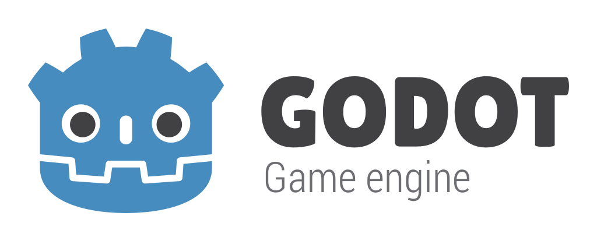

# Game development: Personal recommendations

  

---

## Table of Contents

* [🏗️ What do I need?](#%EF%B8%8F-what-do-i-need)
  * [🐴 Kentucky Route Zero, Undertale & Thomas Was Alone](#-kentucky-route-zero-undertale--thomas-was-alone)
  * [🚀 Now, you](#-now-you)
* [🎭 Pick a genre](#-pick-a-genre)
* [🔧 Tools & Programs](#-tools--programs)
  * [🎨 Art](#-art)
  * [🎵 Audio](#-audio)
  * [⚙️ Engines](#-engines)
* [🌱 Team & Community](#-team--community)
  * [📅 Game Jams](#-game-jams)
    * [📚 Concept](#-concept)
    * [🎮 Main Game Jams](#-main-game-jams)
  * [🏷️ Social media](#-social-media)
  * [💰 Financing](#-financing)
* [🚀 Release & Platforms](#-scripts)
  * [⚡ Game Jolt](#-game-jolt)
  * [🟣 GOG](#-gog)
  * [🪵 Humble Bundle](#-humble-bundle)
  * [🏠 Itch.io](#-itchio)
  * [🔵 Steam](#-steam)
  * [🔥 Create your own website](#-create-your-own-website)
* [🏁 One last note](#-one-last-note)
* [🏛 License](#-license)

---

# 🏗️ What do I need?

That's probably the first question that comes to mind whenever we consider the game development sector as something more than a mere idea: "What do I need? How about the skills required? I am not a great artist. I am not a great programmer. I have no idea about music", and oh, believe me: _you (don't) need to be a hero, Shinji._ If anything, some of your doubts are a natural response that's based on your fears, as the unknown is always a scary path to take. Let me tell you now: this is not easy.

Understand that this specific line of work is not for everyone. We're now at a point where there have been so many layoffs across so many studios that some of the companies are seeing it as an opportune time to make some cuts for more specific reasons, knowing that within a couple of days, there'll be a number of other studios in the spotlight for job losses instead. We keep hearing dramatic stories coming from the industry that involve crunch, low salaries, layoffs, and developers struggling to combat their conditions from the margins. Allow me to repeat myself: It's not easy. It can be soul-crushing at times, just like any other job. It can also be the most fulfilling thing you've ever done in your life, though, as there is nothing that compares to someone playing your creation, enjoying it, and letting you know that it was worth the effort.

  

"**I still do not have the skills**", well, guess what: you don't need _any specific skills_. Luckily for us, we live in a time where we can learn literally _anything_ we need to make a game with relative ease. I do feel you, of course: I feel like an impostor myself, too, but despite what you may think, none of this comes from natural talent; we all just pour our hours and passion into getting better at what we do, and these days, that opportunity is more accessible than it ever was. Opportunities have become possibilities - endless ones. Do you want some examples proving this theory? Then please, allow me to open the door granting you access to my mind during for minutes:

## 🐴 Kentucky Route Zero, Undertale & Thomas Was Alone

The above-mentioned examples are some of my personal favorites, not only due to the quality itself but also because of the underlying connotations connecting these specific creations. Although these are definitely not AAA titles, they all share a common treat: they are damn incredible games. Are you truly worried about **not being an incredible artist**? [Thomas Was Alone](https://store.steampowered.com/app/220780/Thomas_Was_Alone/) is literally made of rectangles, squares... and that's all. All of it - even the particles. And oh, surprise: these shapes and their inherent minimalism will definitely make you cry as not many other games could. How is that even possible? What truly matters, in this case, is the **philosophical commentary** on the nature of life, as well as a story **charmingly narrated** by Danny Wallace. _Thomas Was Alone_ is philosophical, funny, political, sometimes paranoid, sometimes scientific and moral, similar to a cautionary tale. But above all, it is an **incredibly remarkable** artifact.

  

With the unquestionable success of video games in the entertainment industry in the last few years, they are more and more recognized for their artistic values, but visual art is **not about great graphics only**. There has to be something _else,_ and developing an empathy for blocks proves that this "something else" is what **truly prevails.** Does any of you remember [Undertale](https://store.steampowered.com/app/391540/Undertale/), for instance? I bet that's the case, as our dear [❤️ Toby Fox ❤️](https://twitter.com/tobyfox) managed to create one of the most influential indie games ever. There's something you might not know about the development process of such an indie milestone, though - and believe me when I say that this phenomenon affects way more games than we could possibly imagine.

Successfully raising 50 thousand dollars on Kickstarter for the game development and eventually selling 500,000 copies on Steam just 3 months after its launch, _Undertale_ was developed by an individual who had little to no experience in development, and **it shows**. Cover your eyes, programmers: apparently, _Undertale_'s dialogue lives under a massive **1000+ long switch statement**, which is something... terrifying to think about. But that's **not what the player gets to see**. The player does not care about the twists and tweaks related to the source code or the development process itself. What made _Undertale_ unique is that it had a singular — and singularly compelling — hook: you didn’t have to battle the monsters to win the game. In fact, you could play through _Undertale_ without dispatching with a single foe. Each monster had a charmingly idiosyncratic personality that you could exploit to talk them out of fighting you, but if you wanted to, you could also go on a bloody rampage, slaughtering every creature in your path. Why would we care about the rest?

Similarly, the creators of [Kentucky Route Zero](https://store.steampowered.com/app/231200/Kentucky_Route_Zero_PC_Edition/), one of the most impacting and beautiful games ever created, had to face some complicated scenarios due to their backgrounds and limitations as a team. As I reported in a [dedicated article of my personal blog](https://www.karamablog.xyz/kentucky-route-zero-developing-a-tragic-horse/):

> Putting aside the financial commitment, since there was no full-time programmer on the team, Elliott and Tamas had to split coding duties between them, and given the challenging nature of the project and each member of the studio coming from an artistic background, their unique approach made the game’s code difficult to understand. According to Kemenczy himself, the codebase became so idiosyncratic that some of it was absolutely inscrutable; here, as Elliott made clear throughout several interviews on the matter, some decisions ended up being more conceptual than practical, as if they had always understood their own game as a kind of software art project.

  

## 🚀 Now, you

What about **you**? I'd want to kindly ask you to keep the examples we mentioned in mind, and then add some of your favorite ones to your personal list, too.

Think of _Thomas Was Alone_: You can learn to make particles out of simple shapes, and then keep building on top of that concept. Try to picture _Undertale_'s OST, for instance; the recurring use of certain melodies that can be seen as a leitmotif, the simplicity and yet coherent situational music it uses. Does it sound way too complicated? There are tons of royalty-free libraries you could use for your background music and sound effects; you could _even_ grab a recorder, use your mouth or tools around your place, and try to put it together. You **(don't) have to be a hero**, but you can definitely create a shell of a game that accomplishes the basic goals you'd want to represent and deliver to the world. You can learn programming as you go, which means that you can make a game. You have endless tools around you, hands to clap, and free music at reach, which means that you can make a game. Perhaps you don't consider yourself the most talented artist ever, but that's probably your brain telling you that you **can't** do something - and that's not accurate at all.

There are games starring shapes, explosions of colors, and even stick figures. Can you draw a stick or a triangle? Then, you **can make a game.**

---

# 🎭 Pick a genre

Now that I spent some time trying to make you understand that these barriers you are setting in front of you are invisible ones, let's get started. 

As the main goal of this repository is sharing useful tools, tips, and suggestions, I'd want to assume that you've been cooking up some ideas when it comes to the game **you will definitely create**, am I right? That's great! The first thing you should keep in mind, however, is:

1. **Take it easy.**

   We all have our own "voice", and all voices are worth listening to. All of them. If you ask me, one of the main problems that I see these days is that we all want to make the **biggest, most impressive, most amazing game ever seen at first**, but sadly, that usually leads to frustration and unfinished projects. Believe me: **your dream game won't be your first one**, as you'll want to first develop some skills, get comfortable with your tools, and keep exploring the possibilities at your disposal - which are infinite (just like _Bioshock._ Ha, ha...). Please, do not put yourself in such a bad position. Do not spend hours and hours trying to create the new _The Witcher 3._ It takes time, and none of us wants to stay in front of a pile of broken dreams only because we were not capable of setting realistic boundaries.

2. **Deliver something small and keep improving.** 

    That's our starting point: **small pieces of art** that truly display your intention of getting things released. Stay in motion, but do so **wisely**. Your first creation can be an **arcade game**, a **Game Jam creation**, a **narrative work**, a **mod**, or a **unique level**... What truly matters here is having an idea, working on it, delivering it, and getting some feedback in exchange, as well as new tools and knowledge allowing you to work on future projects. These days, we all **look for replayability** on top of **quality**, but the idea of "tons of hours" **doesn't translate into funnier or better games**. Remember: you **won't reach the goal without walking through the valley first** - and that is beautiful, in its own way. You can't force your way into anything.

  

3. **Don't be afraid to give your ideas a try.** 

    Don't forget that **experimentation is more than valid**, especially when it comes to the indie scene. Does your little game involve decisions, a strange and theatrical narrative, techno music, and ancient mechanisms? If it's plausible for you to do it, just go for it. The fact that our ideas do not fit the AAA sector **does not mean that they are less valid or interesting.** 

4. **Organize your projects properly.** 

    Let's see: [Trello](https://trello.com/es), Calendar, Notes, [GitHub Projects](https://docs.github.com/en/issues/planning-and-tracking-with-projects/learning-about-projects/about-projects)... as a personal recommendation, I'd suggest going with tools that **feel comfortable to you and your needs**. For instance, I usually go with a **Design Document** (there are [plenty of templates](https://en.wikipedia.org/wiki/Game_design_document#/media/File:GDD_Example.jpg) around) divided into:
  
    - **Summary**: Genre, software, target audience, scope, budget...
    - **Concept**: General overview, explicitly diving into mechanics, objectives, game progressions, narrative, and themes.
    - **Gameplay**: World, environment, navigation, consequences of decisions...
    - **Art style**. Design keys regarding the main aesthetic lines, programs, assets, and sketches.
    - **Audio design**. Conceptual annotations about the sound effects, music, tools required, inspirations...
    - **Narrative block**. Gathering the most relevant ideas and distribution of scenes here.
    - **Realistic timeline**.

5. **Put feedback first.** 
 
    Things can be quite tough for game developers. During difficult times, the biggest thing to remember is if someone out there liked what you did, you already accomplished your goal. Whenever that moment comes, **talk to these people**, and find out **why they liked what you created**; if someone didn't like your game, **find out why as well**, and then try to fix that specific thing. Believe it or not, this little step will make you get better. It is possible that the game that you made **didn't do well**, but **can you make a better now thanks to that experience**? Spoiler: you definitely can, and that's why I insist a lot on making low-budget games first. They are the best way to start: they don't cost you a lot of time or money, and you can definitely use them as experience.

6. **Grow yourself enough to make great ideas into realities.** 

    It takes time, but it is worth the effort, my dear and future Senior. Don't forget that your first game is something you'll use to grind so that you can make the **real game** you always wanted to develop.

---

# 🔧 Tools & Programs

Let's keep things clear: **no tools or programs are better than others.** If anything, it will all depend on your needs, preferences, budget, and the technologies that fit better your idea.

Now is **the best time in history to make a game**, though: tools are easier to access, and tons of cheap (and even free) versions are available for any discipline. _Any_ of them, guys. Moreover, **social programs** such as [Discord](https://discord.com/) or [Slack](https://slack.com/intl/en-gb/) allow people to work together collaboratively from anywhere; similarly, there are plenty of **storage solutions** making it possible to share files without a huge amount of financial buy-in, like [GitHub](https://github.com), [Google Drive](https://drive.google.com/settings/storage), or [Dropbox](https://www.dropbox.com/).

> [!WARNING]
> Follow a **game** -> **engine** -> **language** approach for your creation. It's pointless to choose a preferred engine that might not fit your game's requirements, so please, put your idea (genre, mechanics, and very basis included) first, and make the rest of the decisions accordingly.

## 🎨 Art

| Tool            | Price           | Performance | Difficulty of Use | Optimal for                              |
|-----------------|-----------------|-------------|-------------------|------------------------------------------|
| _Aseprite_        | Free/Paid            | High        | Moderate          | Pixel art, Sprite animation               |
| _Blender_         | Free            | High        | Moderate-Hard     | 3D Modeling, Animation, Rendering        |
| _Gimp_            | Free            | Moderate    | Moderate          | Image editing, Graphic design            |
| _MS Paint_        | Free (Windows)  | Low         | Easy              | Basic image editing, Drawing             |
| _Photoshop_       | Paid            | High        | Moderate-Hard     | Professional image editing, Design      |

1. [Aseprite](https://www.aseprite.org/) 

    Aseprite is a pixel art tool that is ideal for creating animated sprites and pixel-based art, as it provides features like layers, frame management, and pixel-perfect drawing tools. If there was a ranking, Aseprite would go _God Tier_, especially because it's an affordable powerhouse. What's even better is that if you compile it from [their GitHub repository](https://github.com/aseprite/aseprite), you can get it as an entirely free software.

2. [Blender](https://www.blender.org/) 

    Blender is a powerful open-source 3D animation suite. It includes features for 3D modeling, sculpting, animation, rendering, compositing, motion tracking, and it continues to evolve - as if it wasn't absolutely insane already. Quite an incredible option, if you ask me; even one of my all-time favorites, _Kentucky Route Zero_, relied on its usage!

  

3. [Gimp](https://www.gimp.org/) 

    Gimp, or GNU Image Manipulation Program, is a fantastic, free, and open-source raster graphics editor. It provides sophisticated tools for tasks such as photo retouching, image editing, image composition, and it can become your promotional art/logos/in-game assets bestie if you simply allow it to.

4. [MS Paint](https://canvaspaint.org/) 

    Microsoft Paint, often referred to as MS Paint, is a simple graphics editing program that comes pre-installed on Windows computers. It's easy to use for basic drawing and image editing, but guess what? Incredible games like [Risk of Rain](https://store.steampowered.com/app/248820/Risk_of_Rain/) were made in MS Paint (plus GameMaker), which means that _everything_ is possible independently of the tools you use, guys.

5. [Photoshop](https://www.adobe.com/la/products/photoshop/online.html) 

    Adobe Photoshop is a professional raster graphics editor widely used in the design and editing of images. It offers advanced features for photo editing, digital painting, and graphic design. Clearly Gimp's handsome (and older) "brother", it can still be worth a try if you are into Adobe products.

## 🎵 Audio
| Tool             | Price         | Performance | Difficulty of Use | Optimal for                                      |
|------------------|---------------|-------------|-------------------|--------------------------------------------------|
| _Anvil Studio_     | Free/Paid     | Moderate    | Easy-Moderate      | Music composition, MIDI sequencing               |
| _FamiStudio_       | Free          | Moderate    | Easy-Moderate      | Chiptune music composition for NES/Famicom      |
| _FL Studio_        | Paid          | High        | Moderate           | Digital Audio Workstation (DAW), Music production|
| _GarageBand_       | Free          | Moderate    | Easy-Moderate      | Music composition, Digital Audio Workstation (DAW)|
| _LMMS_             | Free          | Moderate    | Easy-Moderate      | Digital Audio Workstation (DAW), Music production|

1. [Anvil Studio](https://www.anvilstudio.com/) 

    Anvil Studio is a versatile digital audio workstation with features for composing, recording, and editing MIDI music - you can even print sheet music from your creations there! It's suitable for users interested in music composition and MIDI sequencing, and it's also great if you're just starting out or really want a nice old-school feel to your audio. 

2. [FamiStudio](https://famistudio.org/) 

    FamiStudio is a free, open-source music composer designed for creating chiptune music that specializes in music composition for the NES, providing an easy-to-use interface for chiptune enthusiasts and nostalgics (I'm definitely counting myself as one of them). There is a massive fan community built around it, which translates into tons of tutorials to get you started. Similarly to other cases, you can visit their [GitHub](https://github.com/BleuBleu/FamiStudio) and compile the project yourself. Amazing!

3. [FL Studio](https://www.image-line.com/fl-studio) 

    FL Studio, or FruityLoops, is a popular (nor to say gold-standard) digital audio workstation used for music production. It offers a comprehensive set of tools for composing, arranging, recording, editing, mixing, and mastering music. Easy to use, insanely versatile, and fits perfectly the needs of people who are **serious about making magic happen**. The cost for lifetime updates is around 100€, but if you need something powerful and long-lasting, do not hesitate.

4. [GarageBand (macOS only)](https://www.apple.com/mac/garageband/) 

    GarageBand is a digital audio workstation developed by Apple and is available exclusively for macOS users. It's a user-friendly tool for music creation, recording, and editing, suitable for beginners and enthusiasts. Although it's not my favorite option, since it was developed by Apple, it seamlessly integrates into the Mac ecosystem, which offers an intuitive platform for music creation, recording, and editing.

  

5. [LMMS (Linux MultiMedia Studio)](https://lmms.io/lsp/) 

    LMMS is a free, open-source digital audio workstation that is multiplatform, making it available for Linux, Windows, and macOS users. It provides a range of features for music production, composition, and editing. Despite its cost-free nature, LMMS doesn't compromise on functionality, delivering a robust set of tools that rival many paid alternatives.

## ⚙️ Engines

We've been insisting quite a lot on this idea, but **choose an engine that supports your style of game and your financial situation**, no matter what people say about some engines being best or worse. There is no _best_ engine; there are great engines for different kinds of games, and the final outcome will entirely depend on how you use such engines. Do not hesitate: explore your options, find possibilities that are good for the game style you have in mind, build things, and go explore again until you find **the** engine that makes it easier for you to create the game you have in mind. Engines are merely means towards your goal.

> [!NOTE]
> Needless to say, we're not covering all the possible options out there (there are hundreds of engines available online. Literally), but you can find a more exhaustive list in [Engines Database](https://enginesdatabase.com/) and all around the interwebz. Now, it's time for us to check some interesting options:

| Game Engine     | Price       | Performance | Difficulty of Use | Optimal for                                |
|-----------------|-------------|-------------|-------------------|--------------------------------------------|
| _GameMaker_       | Paid        | Moderate    | Moderate          | 2D game development                        |
| _Godot_           | Free        | High        | Moderate          | 2D and 3D game development                |
| _Phaser_          | Free        | Medium      | Easy-Moderate      | 2D game development, HTML5 games          |
| _Ren'Py_          | Free        | Moderate    | Easy              | Visual novels                              |
| _RPG Maker_       | Paid        | Low-Moderate| Easy              | 2D role-playing Games (emphasis on story) |
| _Unity_           | Free/Paid   | High        | Moderate          | 2D and 3D, cross-platform game development |
| _Unreal Engine_   | Free        | High        | Moderate-Hard     | 3D Game Development, realistic graphics   |

1. [GameMaker](https://gamemaker.io/en) 

    

      
    

    GameMaker is a versatile and user-friendly game development engine that caters to both beginners and experienced developers; remember _Undertale_ or a beautiful piece of art like [Hyper Light Drafter](https://store.steampowered.com/app/257850/Hyper_Light_Drifter/)? They both used Game Maker Studio. It employs a visual scripting language, allowing users to create 2D games across various platforms without delving into complex coding; 3D is not its strong suit, though. It's known for its simplicity and rapid prototyping capabilities, and the monetization model is competitive enough, as it's around 100€ for a lifetime license. Although it's also possible to find it for console (80€ per month, in this case), the fact that they don't take royalties is quite neat.

2. [Godot](https://godotengine.org) 

    

      
    

    Godot is a beast **and** an open-source game engine that supports both 2D and 3D game development, and these days it grew enough to be used by major studios. Built by its community, it features a unique scene system and uses its scripting language, GDScript, which is easy to learn (C# is a possibility here, too). Godot emphasizes a collaborative and community-driven approach, offering a range of features for game developers and supporting export to multiple platforms. The best thing is that it is **free**, but not free with royalties; Godot is totally and absolutely free. Use it. Go now, really.

3. [Ren'Py](https://www.renpy.org/) 

    

      
    

    Ren'Py is a specialized visual novel engine designed for creating interactive storytelling experiences. Completely free, it simplifies the development of visual novels and narrative-driven games by using Python scripting. Ren'Py is known for its ease of use, extensive documentation, and its focus on facilitating the creation of engaging narratives; also, it has a great community around it, which means that if you are playing to create the next [Doki Doki Literature Club](https://store.steampowered.com/app/698780/Doki_Doki_Literature_Club/), it can definitely become your ally.

4. [RPG Maker](https://www.rpgmakerweb.com) 

    

      
    
 

    RPG Maker is a series of game development tools that specialize in creating role-playing games (RPGs) with minimal coding. It provides a user-friendly interface for designing characters, maps, and events. While it's often associated with 2D RPGs, newer versions have expanded to support different genres and styles, and believe me when I say that it can be a truly interesting starting point for some specific creations.

5. [Unity](https://unity.com/) 

    

      
    

    Unity is a powerful and widely used game development engine that supports both 2D and 3D game creation. It offers a comprehensive set of tools, a large asset store, and supports a variety of platforms. Unity uses C# as its primary scripting language and is favored by both indie developers and larger studios for its flexibility and scalability. Unfortunately, the recent drama regarding [Unity's pricing changes](https://www.theguardian.com/games/2023/sep/12/unity-engine-fees-backlash-response) lowered a lot the interest of developers in this specific engine, which made them move to Godot instead.

6. [Unreal Engine](https://www.unrealengine.com/en-US) 

    

      
    
 

    Unreal Engine is a robust game development engine known for its stunning 3D graphics and high-end capabilities. Based on a great monetization model (anything beyond 1.000.000€ has a 5% royalty tagged onto it), it provides a visual scripting system called Blueprints and supports C++ for more advanced programming. Although it's entirely free to use for unmonetized projects and symbolizes a great option for startups, it can have quite a steep learning curve. Don't forget that games like [Fornite](https://www.epicgames.com/fortnite/en-US/home) or [Kingdom Hearts 3](https://www.kingdomhearts.com/3/us/home/) exist thanks to it.

    _(Excuse me for the image, by the way, but U5 decided to leave the chat due to its color palette.)_

--- 

# 🌱 Team & Community

One of the factors that seem to intimidate people the most when it comes to game development is the idea of **building a team**. Now that it has become possible to find tons of **Discord servers** dedicated to making games together, as well as **Game Jams** and **events** taking place literally anytime and anywhere, building your own team is way easier than it ever was.

Back the time, my mentor told me that our programming capabilities are like a muscle, and just like every muscle, it requires commitment and constant training to grow it. Similarly, making games is a learned skill that takes time to get better at, and the more game events you attend (or the more projects you work on), the better you will get at them. If I could give you a single piece of advice, I would tell you to **learn from each experience**, as all of them will allow you to learn about yourself, your team, and your own limits - personally and collectively speaking.

The more you expose yourself to certain realities, the more you will understand what you are looking for in a team; from there, the main point will be determining how your team is going to run on the financial side of things, but let's analyze first some main aspects to keep in mind.

## 📅 Game Jams

[Itch.io](https://itch.io/), one of the most relevant marketplaces for independent digital creators, had the gentleness of sharing a [list of game jams](https://itch.io/jams) available on the platform, which also includes a [calendar for upcoming events](https://itch.io/jams/upcoming). Let's make it clear: they are not only fascinating "grinding" areas in terms of experience: game jams are also a fantastic way to push your creative boundaries. With a theme to work around and the clock ticking, you’ll generate ideas you'd never have conjured otherwise - and some of these ideas might surprise you _a lot._

But wait... "How does a game jam work, even?"

### 📚 Concept

Game jams are occasions where games take shape within specified design boundaries. In essence, these events, whether conducted face-to-face or virtually, foster an environment where game developers craft games within defined restrictions to stimulate creativity. These constraints and the themes of game jams vary widely, covering aspects such as:

1. **Time ⏰**

    Most game jams are brief, lasting anywhere from a few hours to weeks. Typically, all game jams adhere to a specific deadline for submissions, accompanied by either straightforward or intricately detailed constraints.

2. **Theme 📜**

    Certain game jams adopt particular themes or topics that unify all game submissions. These could range from broad fantasy-themed game jams to more specific prompts - but that's part of the charm!

3. **Genre 🕹️**

    Many games fall into well-defined genres, such as platformers, puzzles, FPS, etc. Genre-based game jams challenge participants to create something distinctive within the confines of these common game types, as we'll see later.

4. **Tools 🛠️**

    At times, game jams may specify the game engines, software, or other tools to be used - or even avoided. Additionally, there are instances of game jams restricting the type of art programs, music or audio software, and even the medium for traditional artwork.

    

      
    

5. **Platform 🖥️**

    Beyond tools, the specific platform can introduce intriguing design constraints. Let's imagine a Jam restricting game submissions to requiring the aspect ratio of NES video games, as well as their unique sound effects or palette of colors. _This_ can easily happen, guys.

6. **Art direction, assets, and style 🖌️**

    Similar to tool constraints, some game jams aim to enforce a specific artistic style. Examples include having all art assets made in pixel art, which is quite a frequent scenario these days.

7. **Length ⌛**

    Certain game jams impose restrictions on the duration of the game or experience, compelling participants to carefully consider what they can deliver to players within a short timeframe. For instance, there are events challenging developers to create memorable impressions within a single minute of gameplay — a tough yet potentially creativity-inducing constraint we could find during events such as the [One Minute Jam](https://itch.io/jam/one-minute-jam).

### 🎮 Main Game Jams

Although there are literally tons of game jams around the globe:

1. Personally speaking, I would **highly recommend** the very-well-known [7DRL Challenge](https://7drl.com/); to date, there have been nineteen annual 7DRL challenges, and although this specific one focuses on roguelikes, it's also possible to find several themes and genres under the same concept; for instance, the [7DFPS Challenge](https://itch.io/jam/7dfps) encourages users to create first-person shooters, and as impossible as it may sound, great successes like [SUPERHOT](https://store.steampowered.com/app/322500/SUPERHOT/) exist thanks to the creators taking part in such challenges. 

2. The [Global Game Jam](https://globalgamejam.org/), on the other hand, is an annual distributed game jam inspired by the [Nordic Game Jam](https://nordicgamejam.com/). The Global Game Jam is renowned for promoting innovation and experimentation, as developers join forces to bring unique game concepts to life. As a little spoiler, and like many successful indie games, [Keep Talking and Nobody Explodes](https://store.steampowered.com/app/341800/Keep_Talking_and_Nobody_Explodes/) (an asymmetric co-op game where one VR-wearing friend tries to defuse a bomb while their friends talk them through it) began life as a Global Game Jam project.

3. [Ludum Dare](https://ldjam.com) is a recurring online game jam that challenges participants to develop games from scratch within a short period of time (note that there are "mini" LDs, as well as bigger ones), and it typically follows a theme that participants incorporate into their games, pushing developers to think creatively and adapt their ideas to fit within the given constraints. Would you believe me if I said that [Hollow Knight](https://store.steampowered.com/app/367520/Hollow_Knight/), [Gods Will Be Watching](https://store.steampowered.com/app/274290/Gods_Will_Be_Watching/) or [Inscryption](https://store.steampowered.com/app/1092790/Inscryption/) were born during a Ludum Dare event?

  

> [!NOTE]
> For more information, and just in case you skipped the above-mentioned calendar, you can also check some upcoming events [in the form of a chart](https://www.indiegamejams.com/). Phew!

## 🏷️ Social media

Not only a great source of information when it comes to events, jams, and upcoming games, social media offers an answer to one of the main developer's concerns: **visibility**. Although I don't doubt you will become a Triple-A studio with millions of dollars for a marketing budget, it's still necessary for you to **take every chance you can to show people your work**. How do we do it? As usual, in an organized way:

1. **Set up a social hub to get people all in one place.**

    Independently of how great your game is, it will vanish into thin air if there's absolutely no one getting to know and enjoying it. Forget about the size, funding, or possibilities of your studio: building and taking care of your community is not negotiable. As a first step, it would be interesting to **centralize your community** using platforms such as [Discord](https://discord.com/), as they'll provide you with tons of channels, chats, goofy moments, and ways to stay in touch with the initial people showing interest in your game. **Do not lose their faith.** It is crucial to take the proper time to answer and interact with them, and nothing should go above this fact; they are **allowing your game to exist**. Things are visible only when other eyes are staring at them.

2. **Use wider platforms to expand your community and bring them to your hub.**

    Once you found the proper place to bring everyone together (in this example, we took _Discord_ as our initial "hub" due to the interaction possibilities it provides us with), it would be interesting to **use other platforms** to guide individuals back to the main _Discord_ platform and solidify it, as this setup would allow for a cohesive community experience. [Twitter](https://twitter.com), [Twitch](https://twitch.tv), [Reddit](https://reddit.com), [YouTube](https://youtube.com), [Instagram](https://instagram.com)... the idea is to focus on the most active social media platforms (they are constantly changing, so **stay up to date when it comes to that**), and then guide people back to the place we could call "home".

3. **Focus on the community you're building.**

    In essence, prioritize your community. In simpler terms, be kind. Your community is your everything, so tend to it diligently—interact, keep them informed, share memes, and offer merchandise that allows them to express their passion openly. Remember, a thriving community is the lifeblood of any successful game development endeavor.
    
    **TL;DR** - Don't be a jerk, really.

## 💰 Financing

Raising the necessary money as an indie developer can be extremely daunting when you're just starting out. First things first: guys, **do not quit your day job**, as making games starts as a hobby. Keep things small.

As for the number of ways an individual can get some funds for their games, there are a lot out there. In the end, the decision is always up to you, but bear in mind that spreading your game to more platforms makes things harder to manage on the one hand, but might your reach on the other. Go slow, analyze the pros and cons, and move when you are sure you can afford to do it.

1. [Kickstarter](https://www.kickstarter.com/) 

    Kickstarter makes sense as a place to raise funding once you already have a community base and a workable demo; if you are planning to follow this route before you have those things ready, allow me to stop you right away and ask you to reconsider your options. Also, do **not rely on Kickstarter as something that will fund the entire development of your game**, as it should be considered a marketing platform to get initial funding for the necessary hardware or software behind your game.

    

      
    
 

  > [!IMPORTANT]
  > Launch your Kickstarter when you know you will succeed, but not before.

2. **Subscription services** 

    Although [Patreon] is still very popular these days, the truth is that its taxes are both ridiculous **and** hidden enough for people to not realize they are the devil until it's too late. If you are looking for stability and clarity, [Ko-Fi](https://ko-fi.com/) seems to be a great alternative, as it charges a flat fee for its subscription service without hiding the reality of its prices.

3. **Streaming** 

    It is no secret that [Twitch](https://twitch.tv/) has become the cornerstone of several studios' income. Although finding your place can still be a problematic and delicate matter, they finally created a ["Software and Game Development"](https://www.twitch.tv/directory/category/software-and-game-development) category giving developers and their communities a more stable and solid presence. Not an easy path to follow, but the possibility of interacting directly with your community while advertising the work that you do is simply fantastic.

4. **Publishers?** 

    On average, most publishers will ask for approximately 30 or 70% of the income of your game. Now, question: do you really need a publisher? Will they truly help you lead to profits, or will they comfortably smile thinking of the amazingly high part they'll take from the cake? If you can release your game without a publisher, then simply ignore them, as what truly matters these days is closely tied to digital distribution itself.

  > [!TIP]
  > Stay tuned to the awards going on around you! No, awards are not just granted to the best in the best of the industry, and they can definitely help you put out your work on the map.

---

# 🚀 Release & Platforms

You had an idea. Then, you successfully worked on it, to the point that it started taking the desired shape. You shared some bits of it, and people seemed interested enough to keep an eye on you. How about releasing your creation, even if just a playable demo of it? Which are the main distribution platforms? How do they work? I am not an expert myself either, but please, bear in mind that we're learning together here. Now, let's analyze some significant ideas, as there are quite some things to do prior to going through processes such as Steam Greenlight (_aka a feature implemented by Valve to help indie developers sell their games on Steam that's... deprecated. We'll get into that, no worries_).

There are plenty of places where you can launch your games these days, and although many developers took a very Steam-centric-approach when they made the decision to launch their creations (understandable, as Steam is the best monetization platform that probably exists for games), some other alternatives might work out well for you. It's all about trying, and most of the time, no option will satisfy everyone's needs and expectations.

## ⚡ Game Jolt

  Do you have an amazing demo? That's fantastic: [Game Jolt](https://gamejolt.com/games) is considered by many people one of the deities of demo sites, especially since it was founded around 2002 - and still working! You guessed it right: due to its prolongated existence and potential successes, Game Jolt is one of the largest communities in existence for video games and the millions of people around the world who love them. One of the most interesting facts about them is that _even though they do not need to do it_, they give you some **extra cash from the advertisements that run on your games page**. Interesting, to say the least.

## 🟣 GOG

  By embracing a variety of titles, [GOG](https://gog.com) allows developers to reach an audience that appreciates quality content without restrictive digital rights management. This platform is an excellent choice for those aiming to share their games with a community that values freedom and a good gaming experience. **DRM-free content**, guys!

## 🪵 Humble Bundle

  Offering **flexible pricing and charitable contributions**, [Humble Bundle](https://www.humblebundle.com/) is a platform that not only helps you distribute your creations but also supports charitable causes. Although it's a unique opportunity for developers to showcase their work, contribute to causes they care about, and connect with a community that values both gaming and giving back, what's remarkable is that they **can help you improve your sales by distributing other platforms' keys**. Also, they **do not take any amount from your sales unless you donate some of your profit to them**, which makes it a great opportunity for the ones who are just starting out.

## 🏠 Itch.io

  Known for its indie-friendly approach, [Itch.io](https://itch.io) allows developers to publish games of various genres and experimental projects - _and_ their storefronts are simply breathtaking! While it has a more open and creator-centric model, as well as **better customizability than any other site**, it probably lacks in the discoverability department. Besides that, it's interesting to keep in mind that it's possible to **sell keys** (Steam ones, for example) through Itch.io as yet another source of income (_as a personal note, I would probably put it still on top of Game Jolt due to its relevance these days, though._)

  

    
  
 

## 🔵 Steam

  It's difficult, if not impossible, to match [Steam](https://steam.com)'s popularity - and I believe their position hasn't been so stable throughout the years only because we gamers are way too into our old habits. Long story short, _Steam_ left behind their "Steam Greenlight" feature and turned it into [Steam Direct](https://store.steampowered.com/sub/163632), a **submission fee** you will have to pay for each product you wish to sell on their platform (which translates into 100€, approximately). Compared to Steam Greenlight, a feature that let you upload whatever you wanted, Steam Direct will give you back those 100€ only when your game makes over 1.000€ on Steam itself.

  Independently of that, it still provides developers with some of the best perks around: for instance, **adding your game to a sale will normally give you a large boost to discoverability**, especially if you put your work on sale for at least 20% off (don't forget it: visibility is key). Also, launching games in Early access will allow you to get some feedback and use it to improve the game itself before launching it, which again translates into a new burst of visibility.

  Although they take 30% of all sales, it is possible to **implement regional price localization**, which means that **developers can set different prices for their games in various regions**, maximizing their appeal to consumers in those areas. This practice can significantly boost income, as it makes the games more accessible and attractive to a broader global audience. Why? Because then it is possible to adjust the pricing of a product based on the economic conditions and consumer purchasing power in different regions or countries (_which can decrease piracy a lot, by the way)._

## 🔥 Create your own website

  Do you want to set the world on fire? Then, **create your website**! And don't tell me that I'm suggesting this only because I'm quite into creating websites! Seriously now, don't dismiss this suggestion as biased; having your website gives you complete control over how you present your creations, and it can be a perfect option for browser-based video games, for instance. It's a direct channel to your audience, allowing you to showcase your games, communicate with your community, and build your brand, so... why not? Even though you won't end up distributing it via your own website, creating one is a powerful platform to provide visibility not only to your video game but also to your team.

---

# 🏁 One last note

Did you truly make it through here? That's impressive! First things first, allow me to express my gratitude, as well as my best wishes for your upcoming projects. Are you still hesitating, though? Do not worry; we all **kind of feel the same way**. However, sometimes we simply need to stop listening to this voice inside of our heads telling us that we _can't do things._ At times, we just need _someone else_ to say: "You can do it".

Just in case you're wondering, yes: **you can do it**. So please, close this tab, gather your favorite tools, and **go do it now.**

  

**[⬆ Back to Index](#table-of-contents)**

**[🔙 Back to Main Index](/README.md)**

---

# 🏛 License

These words live under the solid structure of the [MIT License](LICENSE.txt), but of course, I do not own any specific platform, engine, or others; I'm the mistress of my thoughts only. Nothing else. The teaser image belongs to the incredible [Baba is You](https://store.steampowered.com/app/736260/Baba_Is_You/), and the rest of the pictures chosen to illustrate my ideas are available on the Interwebz. Free, accessible, lovely and inspiring, they all hold the rights of their games, developers and creators, which have been properly referenced throughout the entirety of the document. Just in case it wasn't clear enough, let me add here a little list:

- [Thomas Was Alone](https://store.steampowered.com/app/220780/Thomas_Was_Alone/).
- [Undertale](https://store.steampowered.com/app/391540/Undertale/).
- [Disco Elysium](https://store.steampowered.com/app/632470/Disco_Elysium__The_Final_Cut/).
- [Kentucky Route Zero](https://store.steampowered.com/app/231200/Kentucky_Route_Zero_PC_Edition/).
- [Night in the Woods](https://store.steampowered.com/app/481510/Night_in_the_Woods/).
- [Celeste](https://store.steampowered.com/app/504230/Celeste/).
- [Hollow Knight](https://store.steampowered.com/app/367520/Hollow_Knight/).
- [Blasphemous](https://store.steampowered.com/app/774361/Blasphemous/).
- [The Cosmic Wheel Sisterhood](https://store.steampowered.com/app/1340480/The_Cosmic_Wheel_Sisterhood/)

Thank you for the amazing games - and thank **you** for reading! Oh, and remember that you can make the Dinosaur extremely happy if you...
 

---

<h1 align="center">
  <a href="https://karamazfolio.xyz/">
</h1>
<h2 align="center">
  
</h2>
